# Flat Index Implementation in FAISS

## Table of Contents
1. [Introduction](#introduction)
2. [Flat Index Fundamentals](#flat-index-fundamentals)
3. [Class Hierarchy](#class-hierarchy)
4. [Core Data Structures](#core-data-structures)
5. [Add Operation](#add-operation)
6. [Search Operation](#search-operation)
7. [Distance Computation](#distance-computation)
8. [Index Variants](#index-variants)
9. [Performance Considerations](#performance-considerations)
10. [Usage Examples](#usage-examples)

---

## Introduction

The Flat Index (`IndexFlat`) is the simplest and most fundamental index type in FAISS. It performs **brute-force exact nearest neighbor search** by storing vectors in their original form and computing distances to all database vectors during search.

### Key Characteristics
- **Exact search**: Returns the true nearest neighbors (100% recall)
- **No training required**: Ready to use immediately after creation
- **Full precision storage**: Vectors stored as float32 without compression
- **Simple but expensive**: O(n × d) per query, where n = database size, d = dimension
- **Foundation for other indexes**: Used as storage backend for many advanced index types

### When to Use Flat Index
- Small to medium datasets (up to ~1 million vectors)
- When exact results are required
- As a baseline for evaluating approximate methods
- As storage backend for composite indexes (HNSW, IVF, etc.)

---

## Flat Index Fundamentals

### Brute-Force Search Concept

The Flat Index implements the most straightforward approach to nearest neighbor search: compare the query vector against every vector in the database.

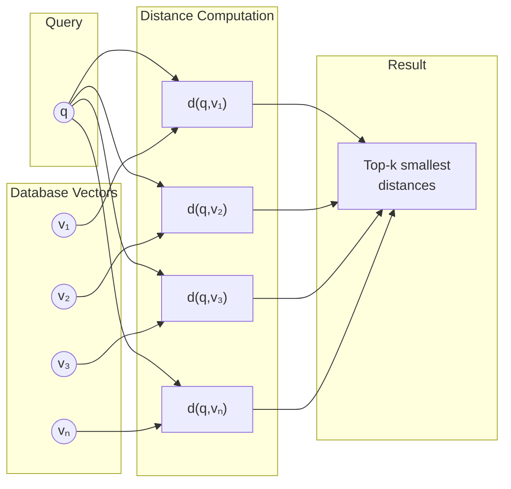

### Memory Layout

Vectors are stored contiguously in memory as a simple array:

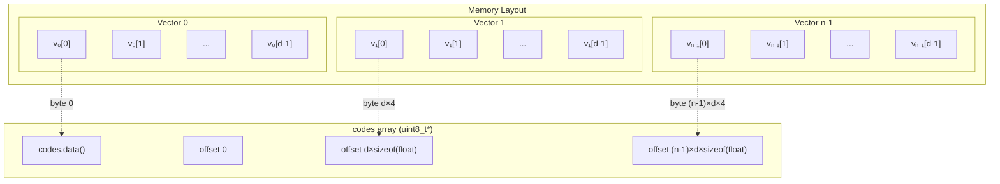

### Supported Distance Metrics

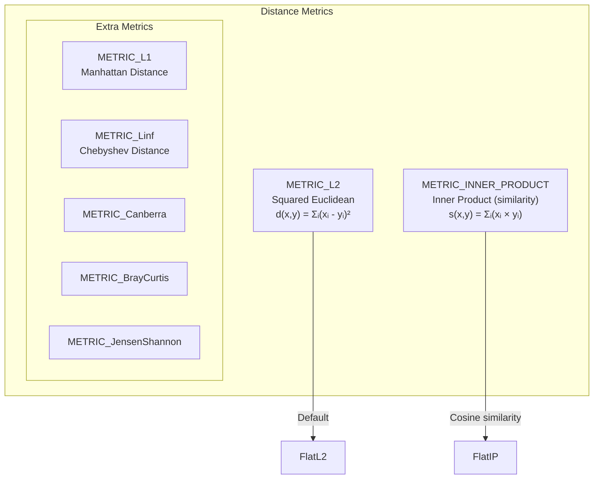

---

## Class Hierarchy

### UML Class Diagram

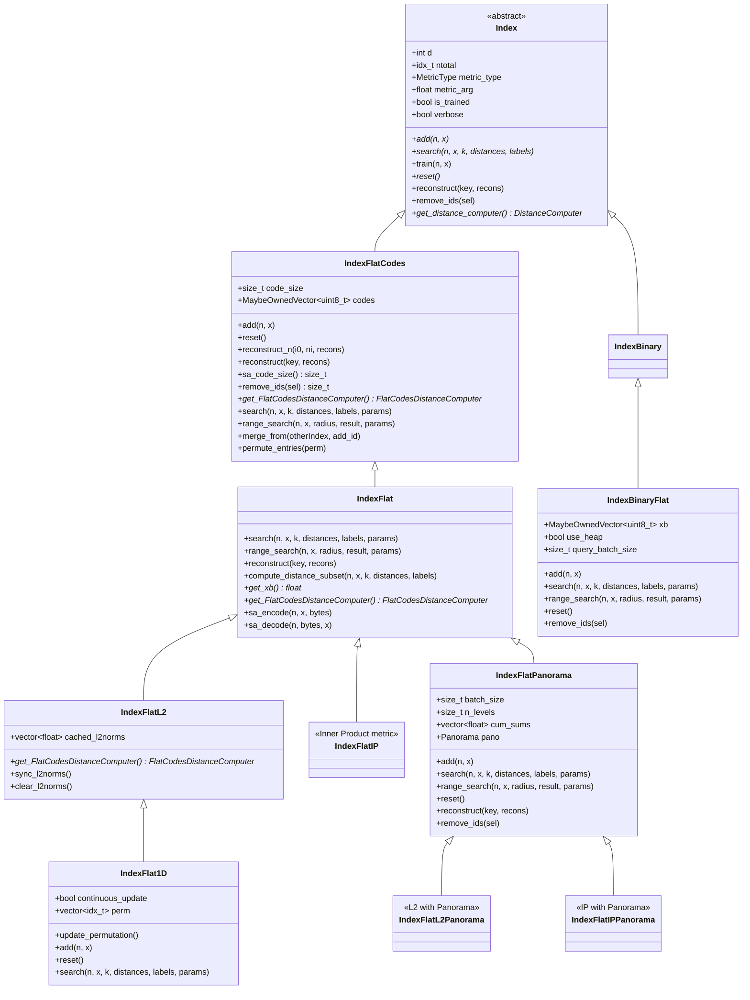

### Distance Computer Hierarchy

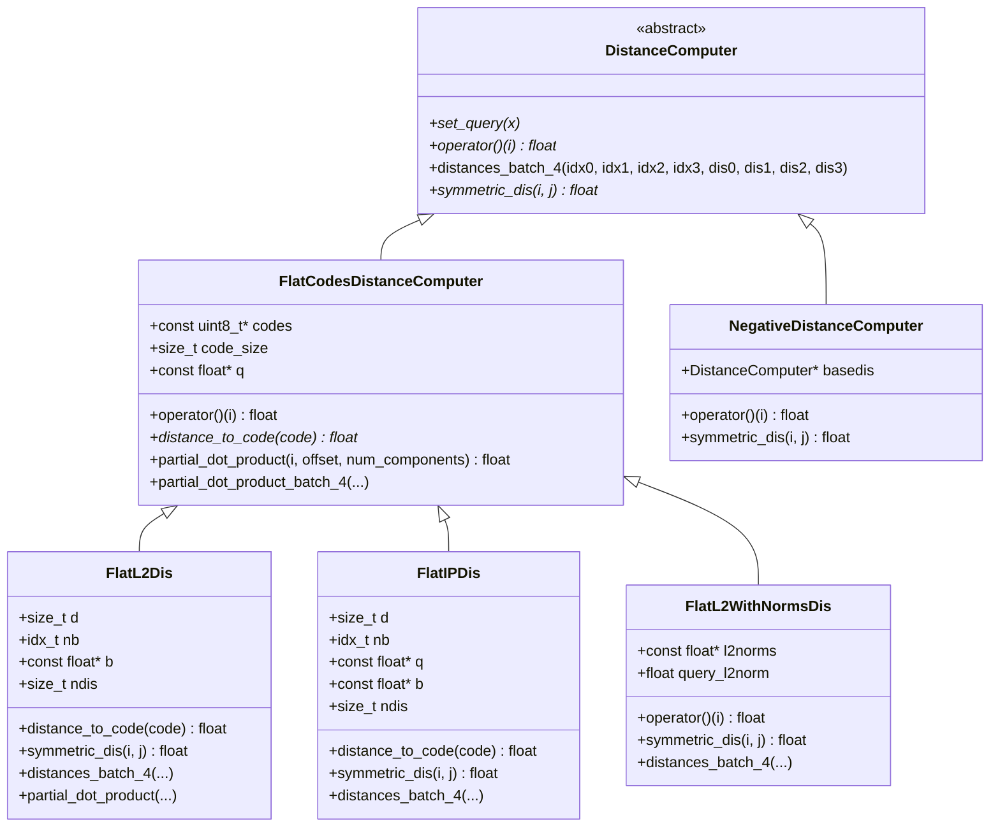

### Component Relationships

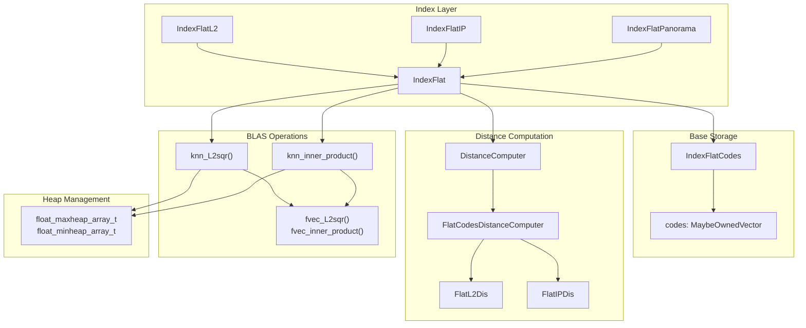

---

## Core Data Structures

### IndexFlatCodes Storage

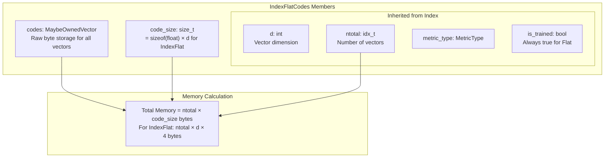

### Heap Structures for k-NN

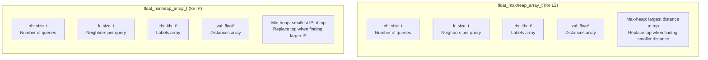

---

## Add Operation

### Add Operation Flowchart

```mermaid
flowchart TD
    START([Start: add n vectors]) --> CHECK[Check is_trained == true]
    CHECK --> ZERO{n == 0?}
    ZERO -->|Yes| END([Return])
    ZERO -->|No| RESIZE[Resize codes array:<br/>codes.resize((ntotal + n) × code_size)]
    RESIZE --> ENCODE[Encode vectors:<br/>sa_encode(n, x, codes.data() + ntotal × code_size)]
    ENCODE --> UPDATE[Update count:<br/>ntotal += n]
    UPDATE --> END
```

### Add Sequence Diagram

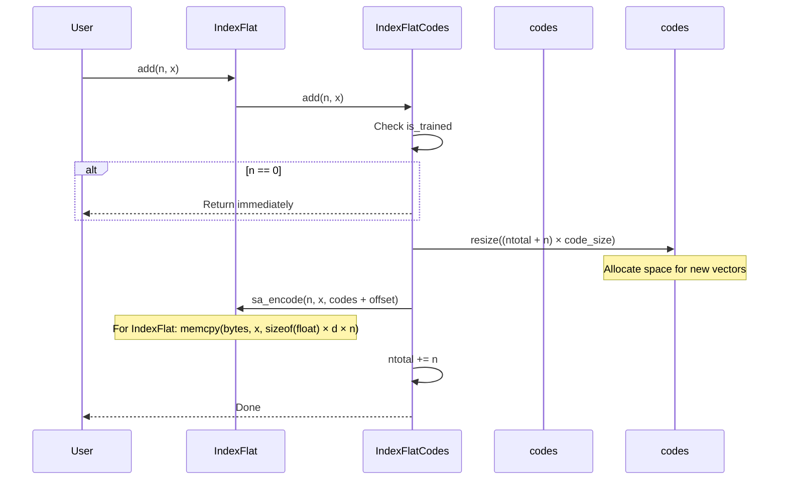

### Encoding for IndexFlat

For `IndexFlat`, encoding is simply a memory copy:

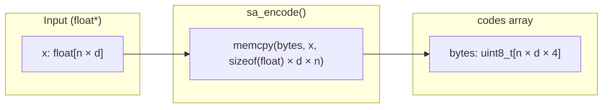

---

## Search Operation

### Search Flowchart

```mermaid
flowchart TD
    START([Start: search n queries for k neighbors]) --> CHECK[Check k > 0]
    CHECK --> GET_SEL[Get IDSelector from params]
    
    GET_SEL --> METRIC{metric_type?}
    
    METRIC -->|METRIC_L2| L2_SEARCH[Create max-heap result structure<br/>knn_L2sqr(x, xb, d, n, ntotal, res)]
    METRIC -->|METRIC_INNER_PRODUCT| IP_SEARCH[Create min-heap result structure<br/>knn_inner_product(x, xb, d, n, ntotal, res)]
    METRIC -->|Other| EXTRA_SEARCH[knn_extra_metrics(...)]
    
    L2_SEARCH --> END([Return sorted results])
    IP_SEARCH --> END
    EXTRA_SEARCH --> END
```

### Search Sequence Diagram

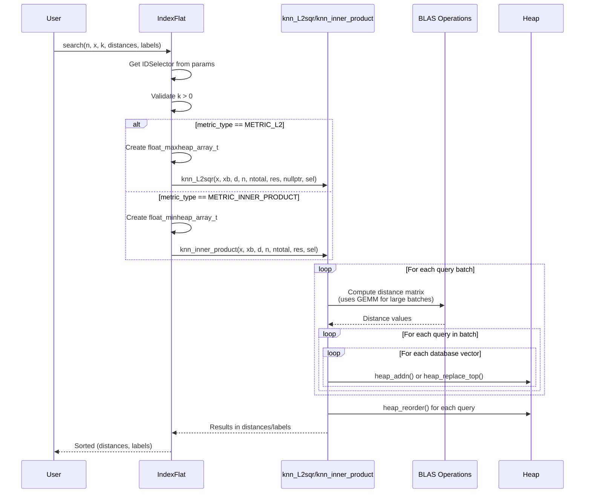

### Distance Computation Strategies

```mermaid
flowchart TD
    subgraph "Strategy Selection"
        SIZE{Database size?}
        
        SIZE -->|"< threshold<br/>(~20 vectors)"| DIRECT[Direct SIMD computation<br/>fvec_L2sqr / fvec_inner_product]
        
        SIZE -->|">= threshold"| BLAS[BLAS-based computation<br/>Matrix multiplication + heap]
    end
    
    subgraph "BLAS Strategy"
        direction TB
        BATCH_Q[Batch queries<br/>query_bs = 4096]
        BATCH_DB[Batch database<br/>database_bs = 1024]
        GEMM["GEMM: compute<br/>distance matrix block"]
        HEAP_ADD[Update heaps with<br/>distance values]
        
        BATCH_Q --> BATCH_DB
        BATCH_DB --> GEMM
        GEMM --> HEAP_ADD
    end
    
    subgraph "Direct Strategy"
        direction TB
        LOOP[Loop over all vectors]
        SIMD[SIMD distance computation<br/>4 vectors at a time]
        HEAP_UP[Heap update]
        
        LOOP --> SIMD
        SIMD --> HEAP_UP
    end
    
    DIRECT --> Direct Strategy
    BLAS --> BLAS Strategy
```

### L2 Distance Computation via BLAS

For L2 distance, the squared distance can be decomposed:

$$\|x - y\|^2 = \|x\|^2 + \|y\|^2 - 2 \langle x, y \rangle$$

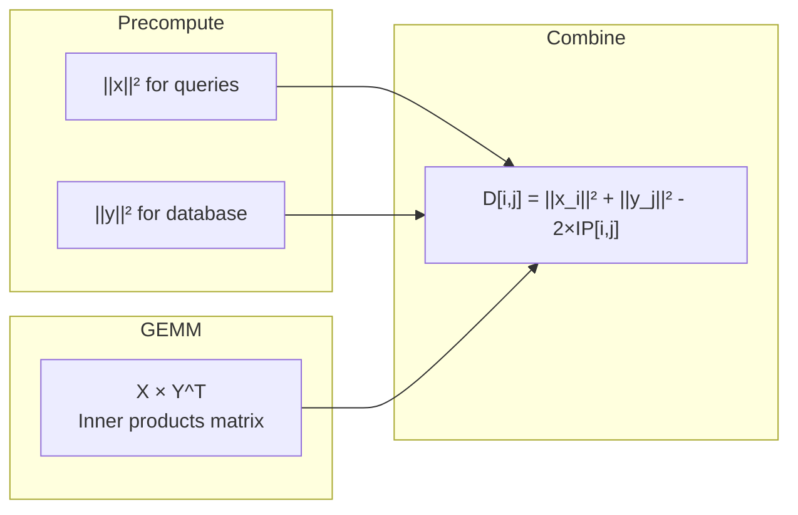

---

## Distance Computation

### FlatL2Dis Implementation

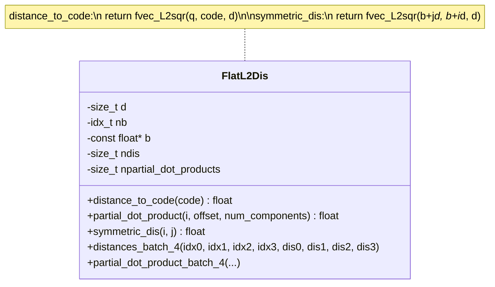

### Batched Distance Computation

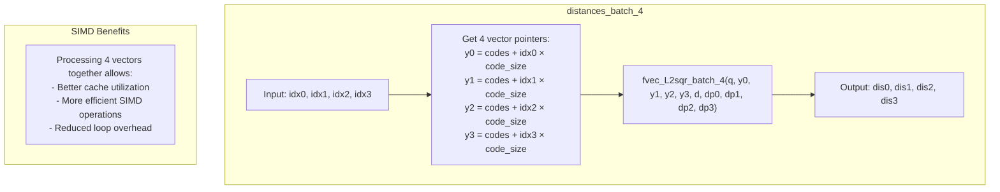

### L2 With Cached Norms

`IndexFlatL2` can cache L2 norms for faster distance computation:

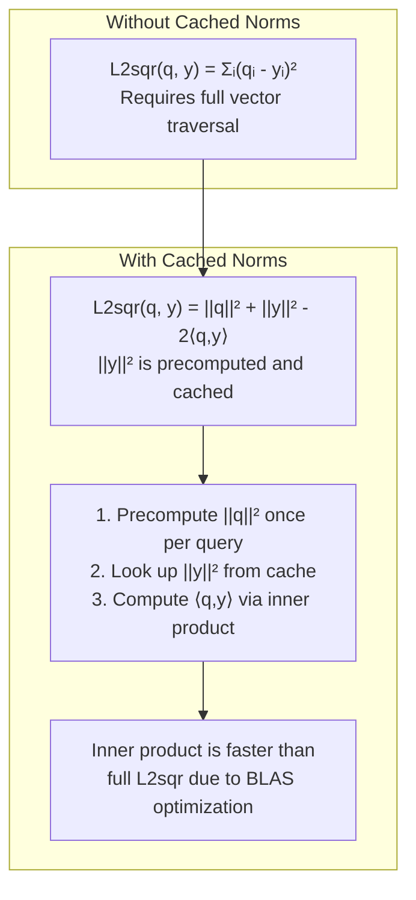

---

## Index Variants

### IndexFlatL2 and IndexFlatIP

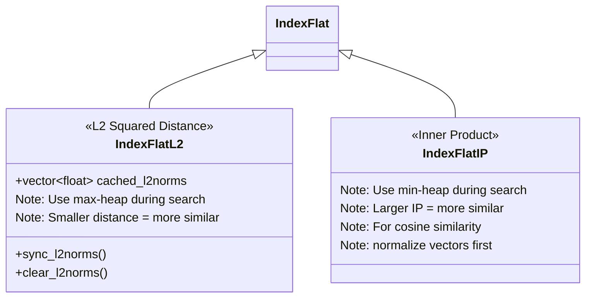

### IndexFlat1D - Optimized for 1D Vectors

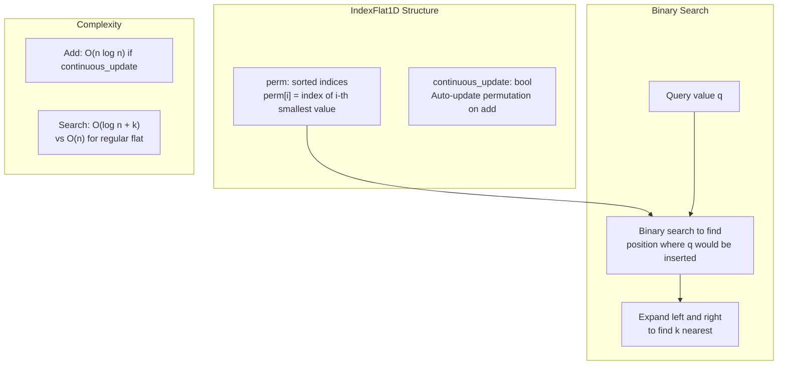

### IndexFlatPanorama - Progressive Refinement

```mermaid
flowchart TD
    subgraph "Panorama Concept"
        LEVELS["Split dimensions into levels<br/>Level 0: dims 0 to w-1<br/>Level 1: dims w to 2w-1<br/>..."]
        CUMSUMS["Precompute cumulative sums<br/>for Cauchy-Schwarz bounds"]
    end
    
    subgraph "Progressive Search"
        INIT["Initialize with full norm bounds"]
        LEVEL_LOOP{More levels?}
        COMPUTE["Compute partial distance<br/>for current level"]
        BOUND["Compute lower bound using<br/>Cauchy-Schwarz inequality"]
        PRUNE{bound > threshold?}
        SKIP["Skip this vector"]
        CONTINUE["Continue to next level"]
        RESULT["Add to results if survived"]
    end
    
    LEVELS --> INIT
    CUMSUMS --> INIT
    INIT --> LEVEL_LOOP
    LEVEL_LOOP -->|Yes| COMPUTE
    COMPUTE --> BOUND
    BOUND --> PRUNE
    PRUNE -->|Yes| SKIP
    SKIP --> LEVEL_LOOP
    PRUNE -->|No| CONTINUE
    CONTINUE --> LEVEL_LOOP
    LEVEL_LOOP -->|No| RESULT
```

### IndexBinaryFlat - Binary Vector Search

```mermaid
classDiagram
    class IndexBinaryFlat {
        +MaybeOwnedVector~uint8_t~ xb
        +bool use_heap
        +size_t query_batch_size
        +ApproxTopK_mode_t approx_topk_mode
        
        +add(n, x)
        +search(n, x, k, distances, labels)
        +range_search(n, x, radius, result)
    }
    
    note for IndexBinaryFlat "Stores binary vectors (bits packed into bytes)\nUses Hamming distance\nVector size: d/8 bytes per vector"
```

---

## Performance Considerations

### Memory Requirements

| Index Type | Memory per Vector | Formula |
|------------|------------------|---------|
| IndexFlat | 4d bytes | `sizeof(float) × d` |
| IndexFlatL2 (with cache) | 4d + 4 bytes | `sizeof(float) × (d + 1)` |
| IndexBinaryFlat | d/8 bytes | `d / 8` |

### Complexity Analysis

| Operation | Time Complexity | Notes |
|-----------|----------------|-------|
| Add n vectors | O(n × d) | Memory copy |
| Search (single query) | O(ntotal × d) | Brute force |
| Search (batch of nq queries) | O(nq × ntotal × d) | Can use BLAS |
| Reconstruct | O(d) | Memory copy |
| Remove IDs | O(ntotal × code_size) | Compaction |

### BLAS Optimization

```mermaid
graph TB
    subgraph "BLAS Configuration"
        THR["distance_compute_blas_threshold = 20<br/>Use BLAS if ntotal >= 20"]
        QBS["distance_compute_blas_query_bs = 4096<br/>Query batch size"]
        DBS["distance_compute_blas_database_bs = 1024<br/>Database batch size"]
    end
    
    subgraph "Benefits"
        B1["Leverages optimized GEMM routines"]
        B2["Better cache utilization"]
        B3["Automatic multi-threading in MKL/OpenBLAS"]
    end
    
    THR --> B1
    QBS --> B2
    DBS --> B3
```

### Parallelization

```mermaid
flowchart LR
    subgraph "Query-Level Parallelism"
        Q1["Query 1"]
        Q2["Query 2"]
        Q3["Query 3"]
        QN["Query n"]
    end
    
    subgraph "OpenMP"
        OMP["#pragma omp parallel for"]
    end
    
    subgraph "Per-Query Processing"
        P1["Thread 1"]
        P2["Thread 2"]
        P3["Thread 3"]
        PN["Thread n"]
    end
    
    Q1 --> OMP
    Q2 --> OMP
    Q3 --> OMP
    QN --> OMP
    
    OMP --> P1
    OMP --> P2
    OMP --> P3
    OMP --> PN
```

### When to Use Each Variant

```mermaid
graph TD
    START{What's your use case?}
    
    START -->|Euclidean distance| L2{Dataset size?}
    START -->|Cosine similarity| IP[IndexFlatIP<br/>Normalize vectors first]
    START -->|Binary vectors| BIN[IndexBinaryFlat]
    START -->|1D data| D1[IndexFlat1D<br/>O(log n) search]
    START -->|High-dim, want pruning| PANO[IndexFlatPanorama]
    
    L2 -->|Small, need caching| L2CACHE[IndexFlatL2<br/>with sync_l2norms()]
    L2 -->|General use| L2REG[IndexFlatL2]
```

---

## Usage Examples

### Basic Usage (C++)

```cpp
#include <faiss/IndexFlat.h>

int main() {
    int d = 64;       // Dimension
    int nb = 100000;  // Database size
    int nq = 10;      // Number of queries
    int k = 4;        // Number of results
    
    // Create index (L2 distance)
    faiss::IndexFlatL2 index(d);
    
    // Check that no training is needed
    assert(index.is_trained);
    
    // Create and add vectors
    std::vector<float> xb(d * nb);
    // ... fill xb with database vectors ...
    index.add(nb, xb.data());
    
    printf("ntotal = %zd\n", index.ntotal);
    
    // Search
    std::vector<float> xq(d * nq);
    // ... fill xq with query vectors ...
    
    std::vector<float> distances(k * nq);
    std::vector<faiss::idx_t> labels(k * nq);
    
    index.search(nq, xq.data(), k, distances.data(), labels.data());
    
    // Results are sorted by distance (ascending for L2)
    return 0;
}
```

### Using Inner Product (Cosine Similarity)

```cpp
#include <faiss/IndexFlat.h>
#include <cmath>

// Normalize vectors for cosine similarity
void normalize(float* x, int d) {
    float norm = 0;
    for (int i = 0; i < d; i++) {
        norm += x[i] * x[i];
    }
    norm = std::sqrt(norm);
    for (int i = 0; i < d; i++) {
        x[i] /= norm;
    }
}

int main() {
    int d = 64;
    
    // Use inner product index
    faiss::IndexFlatIP index(d);
    
    // Normalize vectors before adding
    std::vector<float> xb(d * nb);
    for (int i = 0; i < nb; i++) {
        normalize(xb.data() + i * d, d);
    }
    index.add(nb, xb.data());
    
    // Normalize queries before searching
    std::vector<float> xq(d);
    normalize(xq.data(), d);
    
    // Search - larger IP means more similar
    index.search(1, xq.data(), k, distances.data(), labels.data());
    
    return 0;
}
```

### Python Usage

```python
import faiss
import numpy as np

d = 64        # Dimension
nb = 100000   # Database size
nq = 1000     # Number of queries
k = 4         # Number of results

# Generate random vectors
np.random.seed(1234)
xb = np.random.random((nb, d)).astype('float32')
xq = np.random.random((nq, d)).astype('float32')

# Create L2 index
index = faiss.IndexFlatL2(d)
print(f"is_trained: {index.is_trained}")

# Add vectors
index.add(xb)
print(f"ntotal: {index.ntotal}")

# Search
distances, labels = index.search(xq, k)

# Sanity check: search first 5 database vectors
D, I = index.search(xb[:5], k)
print("First result for each query should be itself:")
print(I)
print(D)  # First distance should be 0
```

### Range Search

```python
import faiss
import numpy as np

d = 64
nb = 10000
nq = 10

xb = np.random.random((nb, d)).astype('float32')
xq = np.random.random((nq, d)).astype('float32')

index = faiss.IndexFlatL2(d)
index.add(xb)

# Range search: find all vectors within radius
radius = 5.0
lims, distances, labels = index.range_search(xq, radius)

# Results are grouped by query
for i in range(nq):
    start, end = lims[i], lims[i + 1]
    print(f"Query {i}: {end - start} results within radius {radius}")
```

### Using with IDSelector

```python
import faiss
import numpy as np

d = 64
nb = 10000
nq = 10
k = 4

xb = np.random.random((nb, d)).astype('float32')
xq = np.random.random((nq, d)).astype('float32')

index = faiss.IndexFlatL2(d)
index.add(xb)

# Search only in a subset of IDs
subset_ids = np.array([100, 200, 300, 400, 500], dtype=np.int64)
selector = faiss.IDSelectorArray(subset_ids)

params = faiss.SearchParameters()
params.sel = selector

# Search only considers vectors in subset_ids
distances, labels = index.search(xq, k, params=params)
```

---

## Summary

The Flat Index in FAISS provides:

1. **Exact nearest neighbor search** - 100% recall guaranteed
2. **No training overhead** - Ready to use immediately
3. **Simple implementation** - Easy to understand and debug
4. **Foundation for other indexes** - Used as storage backend for HNSW, IVF, etc.
5. **Multiple variants** - L2, Inner Product, Binary, 1D, Panorama

### Trade-offs

| Advantage | Disadvantage |
|-----------|--------------|
| Exact results | O(n) search time |
| No training | High memory (full vectors) |
| Simple API | Not scalable to billions of vectors |
| Supports all metrics | CPU intensive for large datasets |

### Recommended Usage

- **Dataset < 100K vectors**: Use directly
- **Dataset 100K - 1M vectors**: Consider with BLAS optimization
- **Dataset > 1M vectors**: Use as storage for approximate indexes (HNSW, IVF)
