# HNSW (Hierarchical Navigable Small World) Implementation in FAISS

## Table of Contents
1. [Introduction](#introduction)
2. [HNSW Algorithm Fundamentals](#hnsw-algorithm-fundamentals)
3. [Class Hierarchy](#class-hierarchy)
4. [Core Data Structures](#core-data-structures)
5. [Index Construction](#index-construction)
6. [Search Algorithm](#search-algorithm)
7. [Neighbor Selection Heuristics](#neighbor-selection-heuristics)
8. [Index Variants](#index-variants)
9. [Performance Considerations](#performance-considerations)
10. [Usage Examples](#usage-examples)

---

## Introduction

HNSW (Hierarchical Navigable Small World) is a graph-based approximate nearest neighbor search algorithm that provides excellent query time performance with high recall. The FAISS implementation is based on the paper:

> *"Efficient and robust approximate nearest neighbor search using Hierarchical Navigable Small World graphs"* by Yu. A. Malkov and D. A. Yashunin (arXiv 2017)

The implementation is heavily influenced by the NMSlib implementation by Yury Malkov and Leonid Boytsov.

### Key Characteristics
- **Graph-based indexing**: Vectors are organized as nodes in a multi-layer graph
- **Hierarchical structure**: Multiple layers with decreasing density from top to bottom
- **Small-world property**: Short-range and long-range connections for efficient navigation
- **Greedy search**: Navigates through the graph starting from entry point
- **Incremental construction**: Supports adding vectors one at a time

---

## HNSW Algorithm Fundamentals

### The Small World Phenomenon

HNSW exploits the "small world" graph property where most nodes can be reached from any other node through a small number of hops. This is achieved by combining:

1. **Local connections**: Links to nearby neighbors in the metric space
2. **Long-range connections**: Links that span larger distances for fast navigation

### Hierarchical Layer Structure

The index consists of multiple layers, where:
- **Layer 0 (base layer)**: Contains all vectors with the densest connections (2*M neighbors per node)
- **Higher layers**: Contain exponentially fewer nodes with M neighbors each
- **Entry point**: A node at the maximum level, used as the starting point for all searches

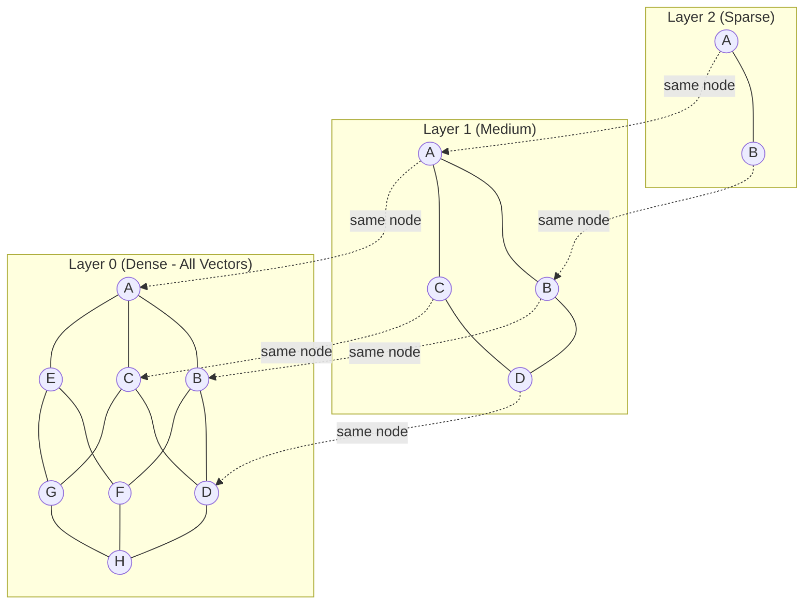

### Level Assignment

Each vector is randomly assigned a maximum level using an exponential distribution:

```
level = floor(-log(uniform_random(0,1)) * levelMult)
```

Where `levelMult = 1/log(M)` and M is the number of neighbors per level.

This ensures:
- Most vectors appear only in layer 0
- Progressively fewer vectors appear in higher layers
- The probability of being at level L is proportional to `exp(-L/levelMult)`

---

## Class Hierarchy

### UML Class Diagram

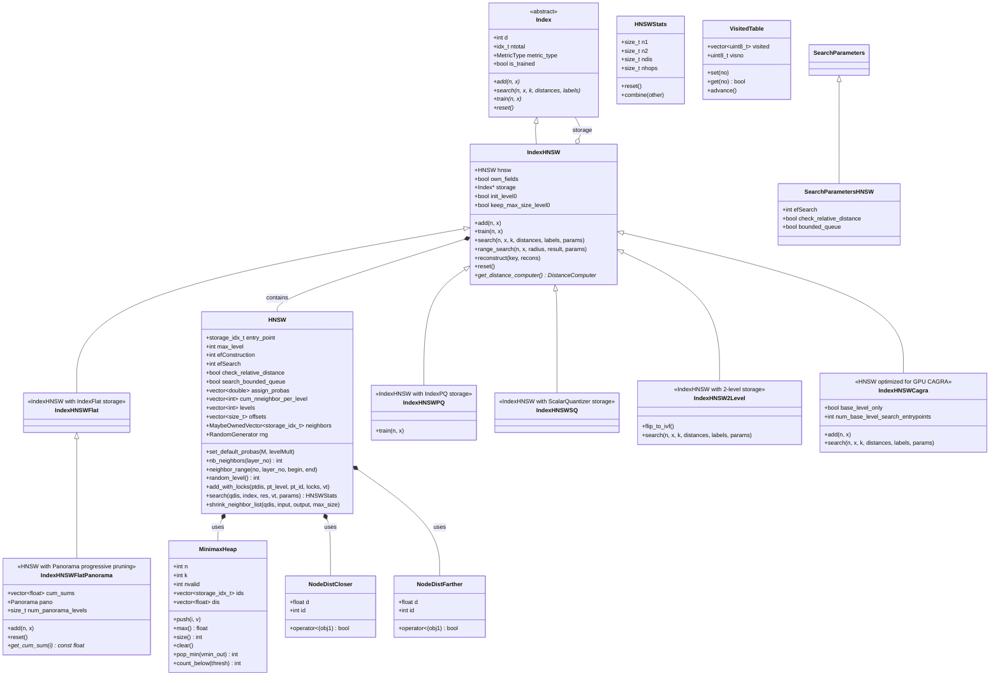

### Component Relationships

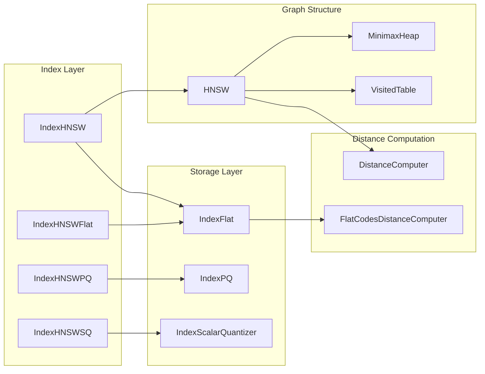

---

## Core Data Structures

### HNSW Graph Storage

The HNSW structure stores the graph connectivity using compact arrays:

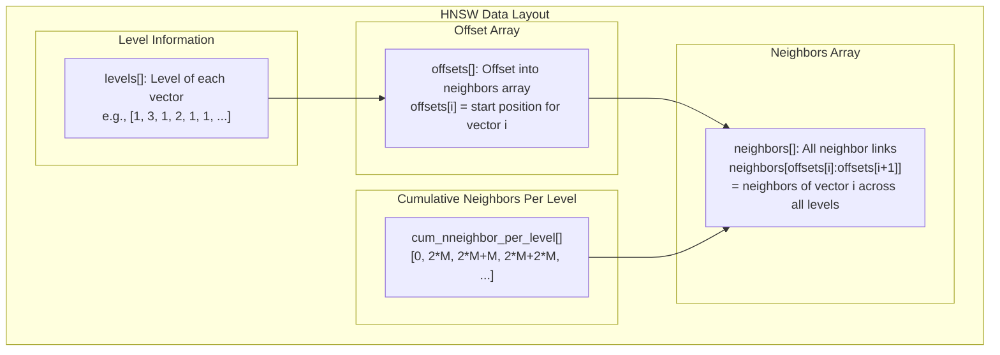

### Neighbor Storage Layout

For a vector at level L, its neighbors across all levels are stored contiguously:

```
neighbors[offsets[i] : offsets[i+1]]
= [level_0_neighbors..., level_1_neighbors..., ..., level_L_neighbors...]
```

Each level's neighbors occupy a fixed range:
- Level 0: `cum_nneighbor_per_level[0]` to `cum_nneighbor_per_level[1]` (2*M slots)
- Level k: `cum_nneighbor_per_level[k]` to `cum_nneighbor_per_level[k+1]` (M slots)

### MinimaxHeap Structure

The MinimaxHeap is a specialized heap that supports both min and max operations efficiently:

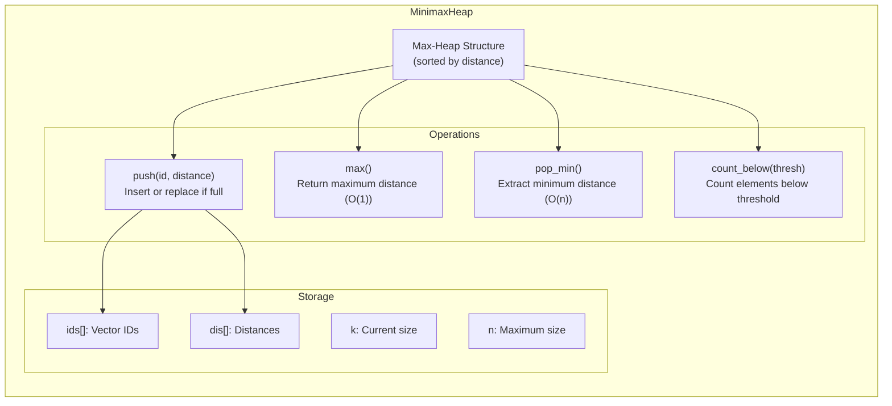

### VisitedTable Structure

Efficient tracking of visited nodes during graph traversal:

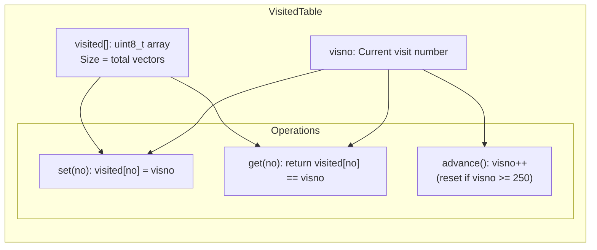

The VisitedTable uses a version number approach to avoid clearing the entire array between searches, making it O(1) to reset.

---

## Index Construction

### Add Operation Flowchart

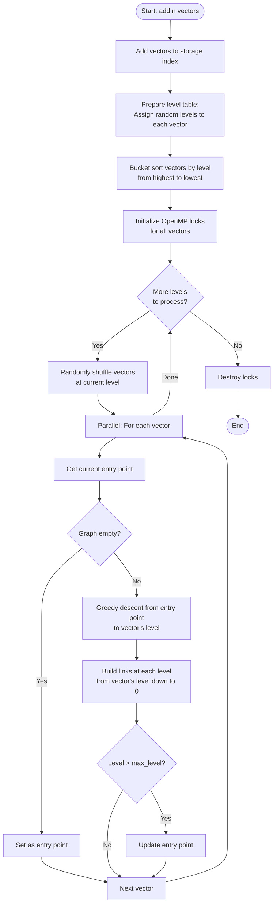

### add_with_locks Sequence Diagram

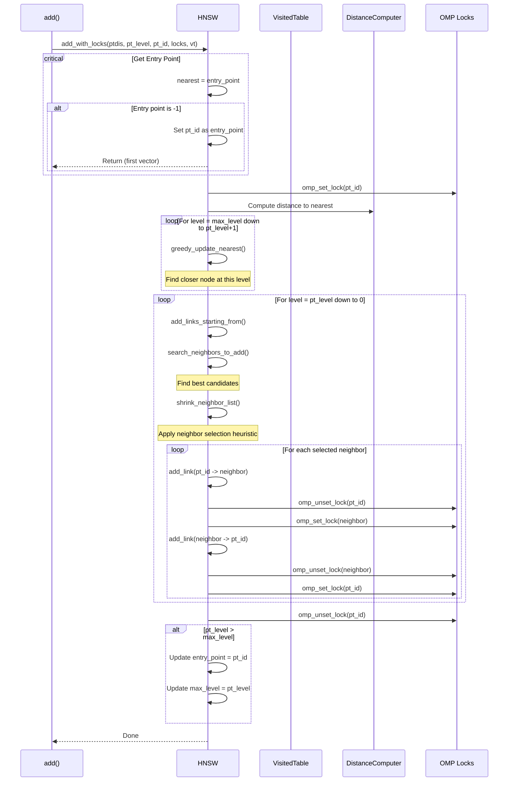

### Neighbor Search During Construction

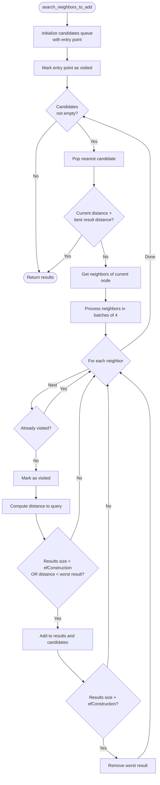

---

## Search Algorithm

### Search Flowchart

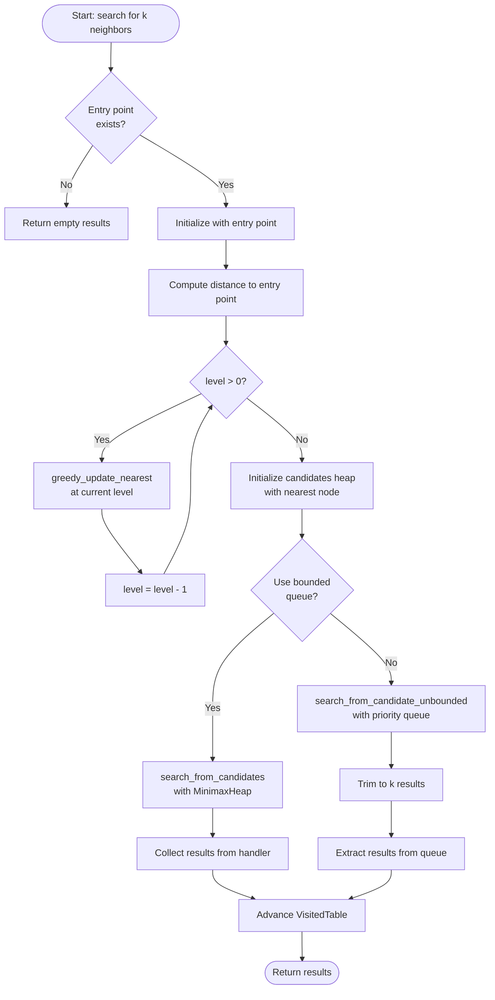

### Search Sequence Diagram

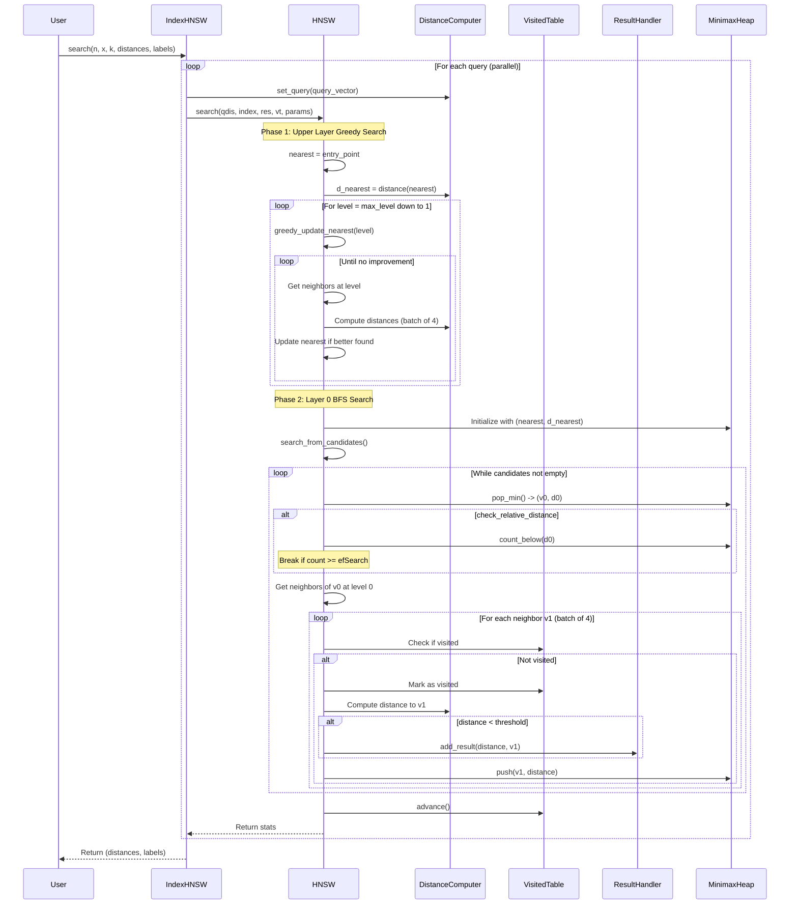

### Greedy Update Nearest

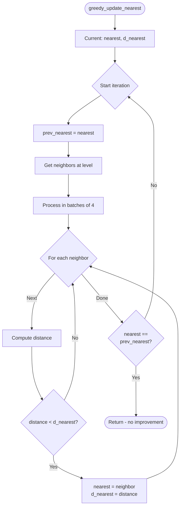

### Search from Candidates (Level 0)

```mermaid
flowchart TD
    START([search_from_candidates]) --> INIT_RES[Initialize results from candidates]
    INIT_RES --> MARK[Mark all candidates as visited]
    
    MARK --> MAIN_LOOP{Candidates<br/>not empty?}
    MAIN_LOOP -->|No| UPDATE_STATS[Update statistics]
    UPDATE_STATS --> END([Return nres])
    
    MAIN_LOOP -->|Yes| POP[pop_min() -> (v0, d0)]
    POP --> DIS_CHECK{check_relative_distance?}
    
    DIS_CHECK -->|Yes| COUNT[count = count_below(d0)]
    COUNT --> EF_CHECK{count >= efSearch?}
    EF_CHECK -->|Yes| UPDATE_STATS
    
    DIS_CHECK -->|No| STEP_CHECK{nstep > efSearch?}
    EF_CHECK -->|No| GET_NEIGH
    STEP_CHECK -->|Yes| UPDATE_STATS
    STEP_CHECK -->|No| GET_NEIGH[Get neighbors of v0]
    
    GET_NEIGH --> PREFETCH[Prefetch visited table entries]
    PREFETCH --> PROCESS_BATCH[Process neighbors in batches of 4]
    
    PROCESS_BATCH --> FOR_NEIGH{For each neighbor v1}
    FOR_NEIGH -->|Done| INC_STEP[nstep++]
    INC_STEP --> MAIN_LOOP
    
    FOR_NEIGH -->|Next| VISIT_CHECK{Already visited?}
    VISIT_CHECK -->|Yes| FOR_NEIGH
    VISIT_CHECK -->|No| MARK_VISIT[Mark as visited]
    MARK_VISIT --> COMPUTE_DIS[Compute distance]
    
    COMPUTE_DIS --> RESULT_CHECK{distance < threshold<br/>AND selector passes?}
    RESULT_CHECK -->|Yes| ADD_RESULT[Add to result handler]
    RESULT_CHECK -->|No| ADD_CAND
    ADD_RESULT --> UPDATE_THRESH[Update threshold]
    UPDATE_THRESH --> ADD_CAND[Add to candidates]
    ADD_CAND --> FOR_NEIGH
```

---

## Neighbor Selection Heuristics

### Shrink Neighbor List Algorithm

The HNSW algorithm uses a heuristic to select diverse neighbors rather than just the closest ones:

```mermaid
flowchart TD
    START([shrink_neighbor_list]) --> INIT[Sort candidates by distance<br/>nearest first]
    INIT --> OUTSIDERS[Initialize outsiders list]
    
    OUTSIDERS --> LOOP{Candidates<br/>not empty?}
    LOOP -->|No| FILL_CHECK{keep_max_size_level0<br/>AND output.size < max_size?}
    
    LOOP -->|Yes| POP[Pop nearest candidate v1]
    POP --> GOOD[good = true]
    
    GOOD --> CHECK_EXIST{For each v2<br/>in output}
    CHECK_EXIST -->|Done| GOOD_CHECK{good?}
    CHECK_EXIST -->|Next| DIST_COMPUTE[Compute dist(v1, v2)]
    DIST_COMPUTE --> CLOSER{dist(v1, v2) <<br/>dist(v1, query)?}
    CLOSER -->|Yes| BAD[good = false]
    CLOSER -->|No| CHECK_EXIST
    BAD --> GOOD_CHECK
    
    GOOD_CHECK -->|Yes| ADD_OUTPUT[Add v1 to output]
    GOOD_CHECK -->|No| KEEP_CHECK{keep_max_size_level0?}
    KEEP_CHECK -->|Yes| ADD_OUTSIDER[Add v1 to outsiders]
    KEEP_CHECK -->|No| LOOP
    ADD_OUTSIDER --> LOOP
    
    ADD_OUTPUT --> SIZE_CHECK{output.size >= max_size?}
    SIZE_CHECK -->|Yes| END([Return output])
    SIZE_CHECK -->|No| LOOP
    
    FILL_CHECK -->|Yes| FILL[Fill with outsiders]
    FILL_CHECK -->|No| END
    FILL --> END
```

### Neighbor Selection Rationale

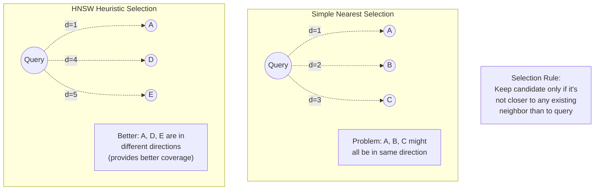

The heuristic ensures:
1. **Diversity**: Neighbors span different directions in the metric space
2. **Coverage**: Better exploration during search
3. **Quality**: Improved recall at the same search cost

---

## Index Variants

### IndexHNSWFlat

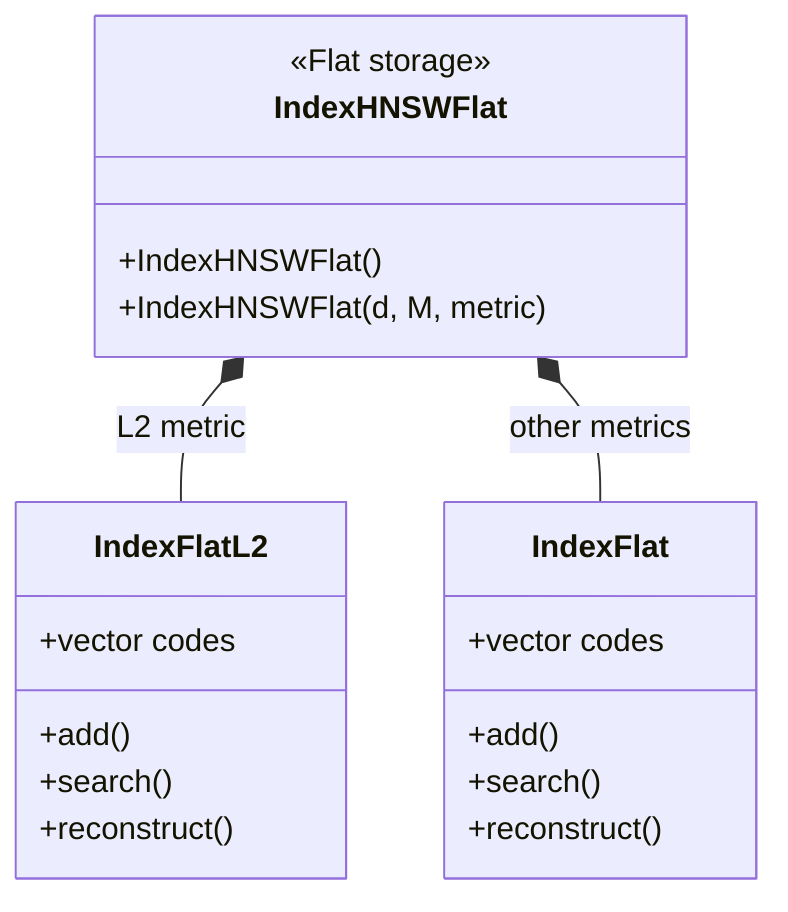

- **Storage**: Full precision vectors
- **Memory**: O(n * d * 4) bytes for vectors + graph overhead
- **Distance**: Exact distance computation
- **Use case**: When memory permits and accuracy is paramount

### IndexHNSWPQ

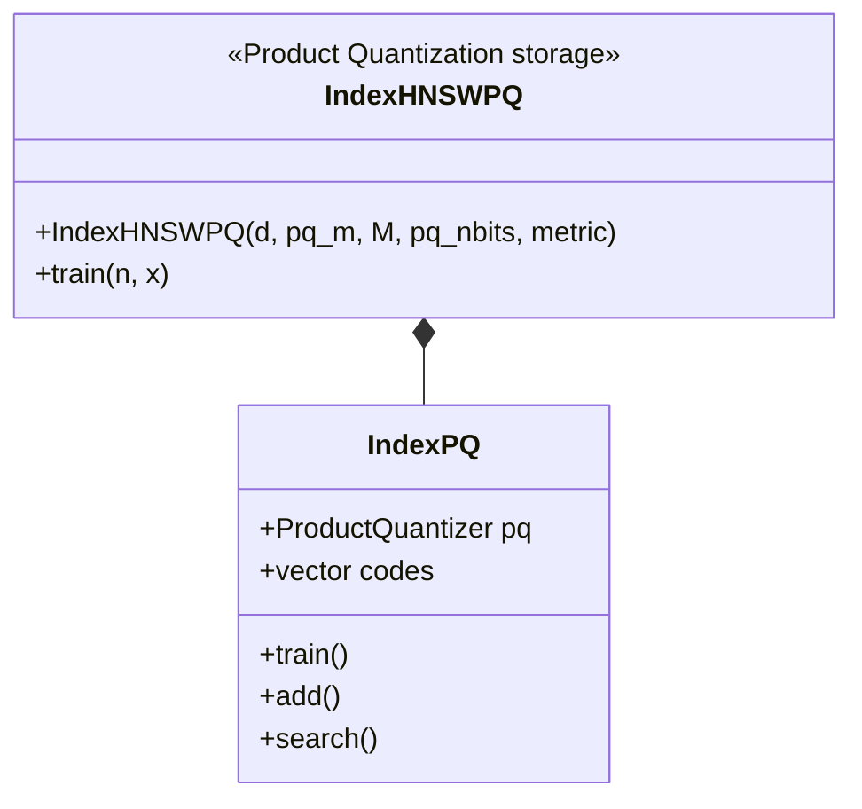

- **Storage**: PQ-compressed vectors
- **Memory**: O(n * pq_m * pq_nbits/8) bytes for vectors
- **Distance**: Approximate via lookup tables
- **Use case**: Large-scale scenarios requiring memory reduction

### IndexHNSWSQ

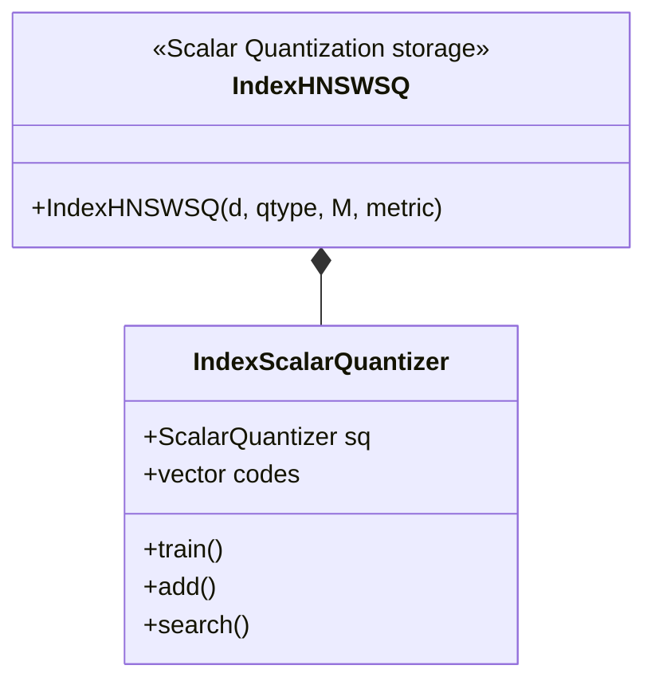

- **Storage**: Scalar-quantized vectors (e.g., fp16, int8)
- **Memory**: Depends on quantization type
- **Distance**: Approximate via quantized values
- **Use case**: Balance between memory and accuracy

### IndexHNSWFlatPanorama

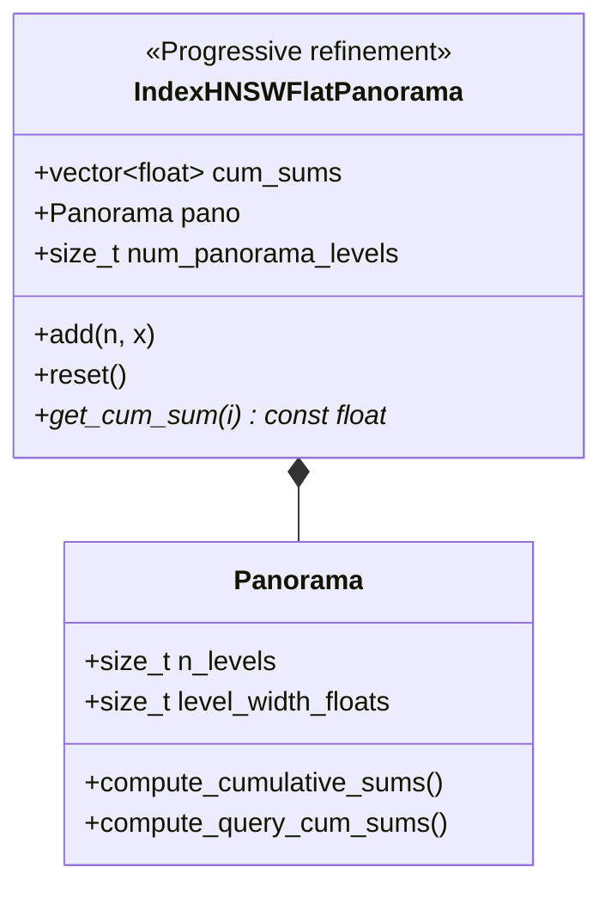

- **Feature**: Progressive distance refinement with early pruning
- **Best for**: High-dimensional vectors (d > 512)
- **Tradeoff**: May have slightly different recall due to approximate beam ordering

---

## Performance Considerations

### Memory Layout

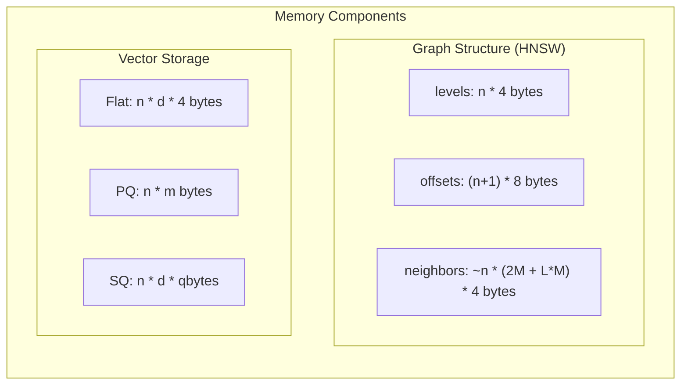

### Key Parameters

| Parameter | Default | Effect |
|-----------|---------|--------|
| **M** | 32 | Number of neighbors per layer (higher = better recall, more memory) |
| **efConstruction** | 40 | Search depth during construction (higher = better graph, slower build) |
| **efSearch** | 16 | Search depth during query (higher = better recall, slower query) |

### Parameter Tuning Guidelines

```mermaid
graph TB
    subgraph "Construction Parameters"
        M["M (neighbors per level)<br/>- Higher: better recall<br/>- Lower: less memory, faster search"]
        EFC["efConstruction<br/>- Higher: better graph quality<br/>- Lower: faster build time"]
    end
    
    subgraph "Search Parameters"
        EFS["efSearch<br/>- Higher: better recall<br/>- Lower: faster queries"]
        BQ["search_bounded_queue<br/>- true: faster, slightly less accurate<br/>- false: more thorough search"]
    end
    
    subgraph "Trade-offs"
        T1["Memory vs Recall"]
        T2["Build Time vs Search Quality"]
        T3["Query Time vs Recall"]
    end
    
    M --> T1
    EFC --> T2
    EFS --> T3
```

### Parallelization

```mermaid
flowchart LR
    subgraph "Construction"
        C1[Parallel vector addition<br/>per level bucket]
        C2[OMP locks for<br/>concurrent updates]
    end
    
    subgraph "Search"
        S1[Parallel queries<br/>OMP for loop]
        S2[Per-thread VisitedTable<br/>and DistanceComputer]
    end
    
    subgraph "Optimizations"
        O1[Batch distance computation<br/>4 neighbors at a time]
        O2[Prefetching visited table]
        O3[SIMD MinimaxHeap operations<br/>AVX2/AVX512]
    end
```

### Complexity Analysis

| Operation | Time Complexity | Notes |
|-----------|----------------|-------|
| Add one vector | O(log n * M * efConstruction) | Average case |
| Search | O(log n + k * efSearch) | Average case |
| Memory | O(n * M * avg_level) | For graph structure |

---

## Usage Examples

### Basic Usage (C++)

```cpp
#include <faiss/IndexHNSW.h>

int main() {
    int d = 128;        // Dimension
    int M = 32;         // Number of neighbors
    int nb = 100000;    // Database size
    int k = 10;         // Number of results
    
    // Create index
    faiss::IndexHNSWFlat index(d, M);
    
    // Set construction parameter
    index.hnsw.efConstruction = 40;
    
    // Add vectors
    std::vector<float> xb(d * nb);
    // ... fill xb with data ...
    index.add(nb, xb.data());
    
    // Set search parameter
    index.hnsw.efSearch = 64;
    
    // Search
    std::vector<float> xq(d);
    // ... fill xq with query ...
    
    std::vector<float> distances(k);
    std::vector<faiss::idx_t> labels(k);
    
    index.search(1, xq.data(), k, distances.data(), labels.data());
    
    return 0;
}
```

### Using Search Parameters

```cpp
// Create custom search parameters
faiss::SearchParametersHNSW params;
params.efSearch = 128;
params.check_relative_distance = true;
params.bounded_queue = true;

// Search with parameters
index.search(nq, xq, k, distances, labels, &params);
```

### Python Usage

```python
import faiss
import numpy as np

d = 128
M = 32
nb = 100000
nq = 1000
k = 10

# Create index
index = faiss.IndexHNSWFlat(d, M)

# Set parameters
index.hnsw.efConstruction = 40
index.hnsw.efSearch = 64

# Add vectors
xb = np.random.random((nb, d)).astype('float32')
index.add(xb)

# Search
xq = np.random.random((nq, d)).astype('float32')
distances, labels = index.search(xq, k)
```

### Using Different Storage Types

```python
import faiss

d = 128
M = 32

# Flat storage (full precision)
index_flat = faiss.IndexHNSWFlat(d, M)

# PQ storage (compressed)
pq_m = 16  # Number of subquantizers
index_pq = faiss.IndexHNSWPQ(d, pq_m, M)
index_pq.train(training_data)

# Scalar quantizer storage
index_sq = faiss.IndexHNSWSQ(d, faiss.ScalarQuantizer.QT_8bit, M)
index_sq.train(training_data)
```

---

## Summary

HNSW in FAISS provides a highly efficient approximate nearest neighbor search algorithm with:

1. **Multi-layer graph structure** for logarithmic search complexity
2. **Intelligent neighbor selection** using diversity heuristics
3. **Flexible storage options** (Flat, PQ, SQ) for different memory/accuracy trade-offs
4. **Highly optimized implementation** with SIMD operations and parallel processing
5. **Configurable parameters** for tuning recall/speed trade-offs

The implementation supports both construction-time and search-time parameter tuning, making it suitable for a wide range of use cases from high-accuracy scientific applications to large-scale production systems.
