# FAISS IVFFlat Implementation Details

## Table of Contents
1. [Introduction to Inverted File Index with Flat Quantizer](#1-introduction-to-inverted-file-index-with-flat-quantizer)
2. [Conceptual Overview](#2-conceptual-overview)
3. [Class Hierarchy and UML Diagrams](#3-class-hierarchy-and-uml-diagrams)
4. [Component Details](#4-component-details)
5. [Operation Flowcharts](#5-operation-flowcharts)
6. [Sequence Diagrams](#6-sequence-diagrams)
7. [Data Structures](#7-data-structures)
8. [Performance Considerations](#8-performance-considerations)

---

## 1. Introduction to Inverted File Index with Flat Quantizer

### What is IVFFlat?

**IVFFlat** (Inverted File Index with Flat storage) is a fundamental approximate nearest neighbor (ANN) search index in FAISS. It combines two key ideas:

1. **Inverted File (IVF)**: A technique borrowed from information retrieval that partitions the vector space into clusters and maintains an inverted index mapping each cluster to the vectors it contains.

2. **Flat Storage**: Vectors are stored in their original, uncompressed form (raw float values), providing exact distance computation within each cluster.

### Why Use IVFFlat?

The main advantages are:

- **Speed**: Instead of comparing the query against all database vectors (exhaustive search), IVFFlat only searches within a subset of clusters
- **Accuracy**: Since vectors are stored uncompressed, distance computations within clusters are exact
- **Simplicity**: No lossy encoding of vectors means no reconstruction error
- **Memory**: Trade-off between index size (full vector storage) and search accuracy

### The Core Idea

```
Instead of: Query → Compare with ALL N vectors → Top K results
IVFFlat:    Query → Find nearest clusters → Compare with vectors in those clusters → Top K results
```

---

## 2. Conceptual Overview

### How IVF Works

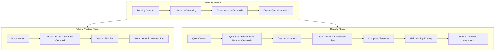
```mermaid
flowchart TB
    subgraph Training["Training Phase"]
        T1[Training Vectors] --> T2[K-Means Clustering]
        T2 --> T3[Generate nlist Centroids]
        T3 --> T4[Create Quantizer Index]
    end
    
    subgraph Adding["Adding Vectors Phase"]
        A1[Input Vector] --> A2[Quantizer: Find Nearest Centroid]
        A2 --> A3[Get List Number]
        A3 --> A4[Store Vector in Inverted List]
    end
    
    subgraph Searching["Search Phase"]
        S1[Query Vector] --> S2[Quantizer: Find nprobe Nearest Centroids]
        S2 --> S3[Get List Numbers]
        S3 --> S4[Scan Vectors in Selected Lists]
        S4 --> S5[Compute Distances]
        S5 --> S6[Maintain Top-K Heap]
        S6 --> S7[Return K Nearest Neighbors]
    end
    
    Training --> Adding
    Training --> Searching
```

### Key Parameters

| Parameter | Description | Typical Values |
|-----------|-------------|----------------|
| `d` | Vector dimension | 64, 128, 256, etc. |
| `nlist` | Number of clusters/inverted lists | √N to 4√N where N is dataset size |
| `nprobe` | Number of clusters to search | 1 to nlist (higher = more accurate but slower) |
| `metric_type` | Distance metric (L2 or Inner Product) | METRIC_L2, METRIC_INNER_PRODUCT |

### The Quantization Process

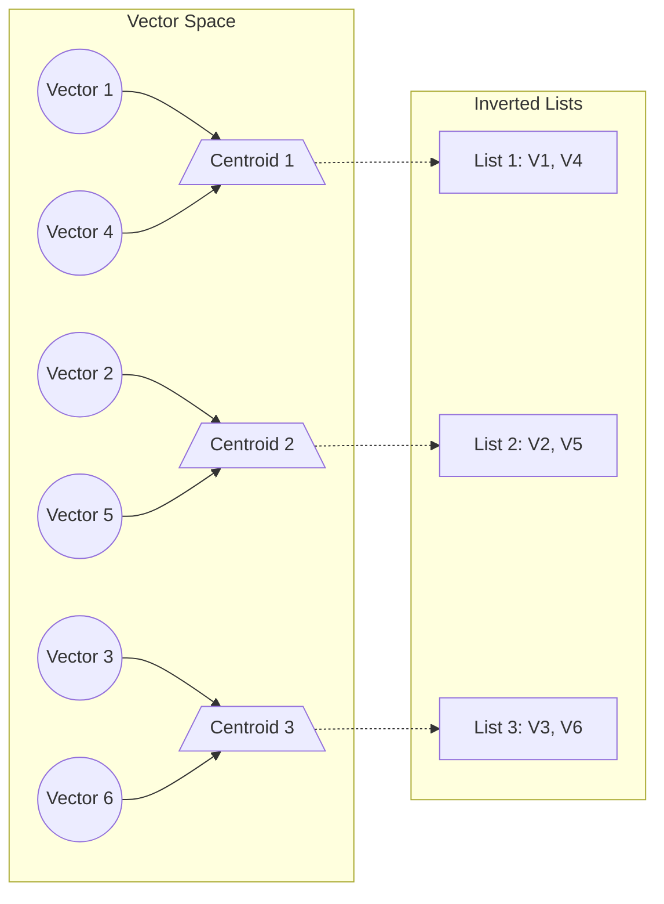
```mermaid
flowchart LR
    subgraph VectorSpace["Vector Space"]
        V1((Vector 1))
        V2((Vector 2))
        V3((Vector 3))
        V4((Vector 4))
        V5((Vector 5))
        V6((Vector 6))
        
        C1[/Centroid 1\]
        C2[/Centroid 2\]
        C3[/Centroid 3\]
    end
    
    subgraph InvertedLists["Inverted Lists"]
        L1["List 1: V1, V4"]
        L2["List 2: V2, V5"]
        L3["List 3: V3, V6"]
    end
    
    C1 -.-> L1
    C2 -.-> L2
    C3 -.-> L3
    
    V1 --> C1
    V4 --> C1
    V2 --> C2
    V5 --> C2
    V3 --> C3
    V6 --> C3
```

---

## 3. Class Hierarchy and UML Diagrams

### Main Class Hierarchy

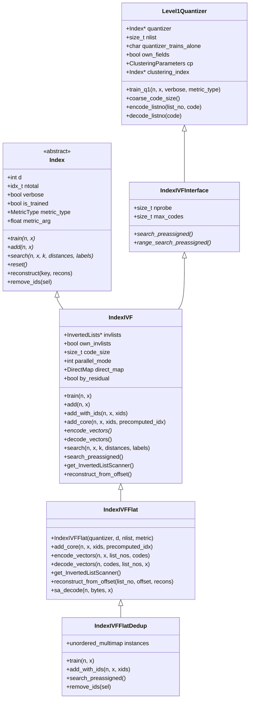
```mermaid
classDiagram
    class Index {
        <<abstract>>
        +int d
        +idx_t ntotal
        +bool verbose
        +bool is_trained
        +MetricType metric_type
        +float metric_arg
        +train(n, x)*
        +add(n, x)*
        +search(n, x, k, distances, labels)*
        +reset()*
        +reconstruct(key, recons)
        +remove_ids(sel)
    }
    
    class Level1Quantizer {
        +Index* quantizer
        +size_t nlist
        +char quantizer_trains_alone
        +bool own_fields
        +ClusteringParameters cp
        +Index* clustering_index
        +train_q1(n, x, verbose, metric_type)
        +coarse_code_size()
        +encode_listno(list_no, code)
        +decode_listno(code)
    }
    
    class IndexIVFInterface {
        +size_t nprobe
        +size_t max_codes
        +search_preassigned()*
        +range_search_preassigned()*
    }
    
    class IndexIVF {
        +InvertedLists* invlists
        +bool own_invlists
        +size_t code_size
        +int parallel_mode
        +DirectMap direct_map
        +bool by_residual
        +train(n, x)
        +add(n, x)
        +add_with_ids(n, x, xids)
        +add_core(n, x, xids, precomputed_idx)
        +encode_vectors()*
        +decode_vectors()
        +search(n, x, k, distances, labels)
        +search_preassigned()
        +get_InvertedListScanner()
        +reconstruct_from_offset()
    }
    
    class IndexIVFFlat {
        +IndexIVFFlat(quantizer, d, nlist, metric)
        +add_core(n, x, xids, precomputed_idx)
        +encode_vectors(n, x, list_nos, codes)
        +decode_vectors(n, codes, list_nos, x)
        +get_InvertedListScanner()
        +reconstruct_from_offset(list_no, offset, recons)
        +sa_decode(n, bytes, x)
    }
    
    class IndexIVFFlatDedup {
        +unordered_multimap instances
        +train(n, x)
        +add_with_ids(n, x, xids)
        +search_preassigned()
        +remove_ids(sel)
    }
    
    Index <|-- IndexIVF
    Level1Quantizer <|-- IndexIVFInterface
    IndexIVFInterface <|-- IndexIVF
    IndexIVF <|-- IndexIVFFlat
    IndexIVFFlat <|-- IndexIVFFlatDedup
```

### InvertedLists Class Hierarchy

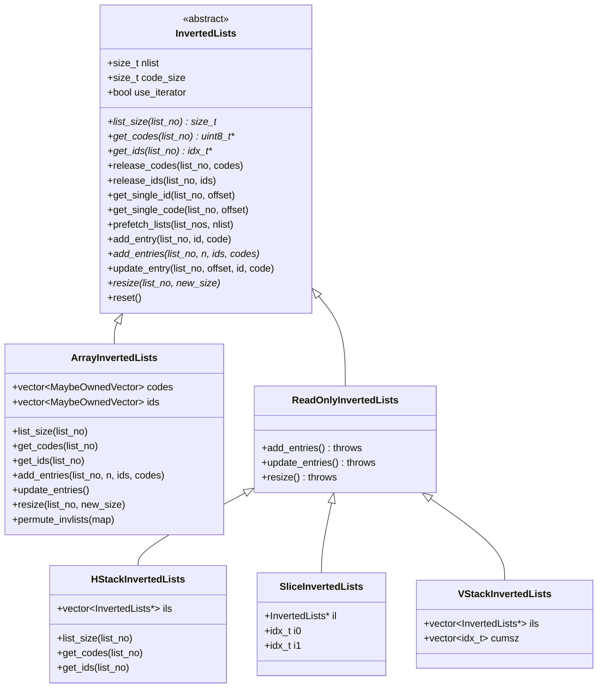
```mermaid
classDiagram
    class InvertedLists {
        <<abstract>>
        +size_t nlist
        +size_t code_size
        +bool use_iterator
        +list_size(list_no)* size_t
        +get_codes(list_no)* uint8_t*
        +get_ids(list_no)* idx_t*
        +release_codes(list_no, codes)
        +release_ids(list_no, ids)
        +get_single_id(list_no, offset)
        +get_single_code(list_no, offset)
        +prefetch_lists(list_nos, nlist)
        +add_entry(list_no, id, code)
        +add_entries(list_no, n, ids, codes)*
        +update_entry(list_no, offset, id, code)
        +resize(list_no, new_size)*
        +reset()
    }
    
    class ArrayInvertedLists {
        +vector~MaybeOwnedVector~ codes
        +vector~MaybeOwnedVector~ ids
        +list_size(list_no)
        +get_codes(list_no)
        +get_ids(list_no)
        +add_entries(list_no, n, ids, codes)
        +update_entries()
        +resize(list_no, new_size)
        +permute_invlists(map)
    }
    
    class ReadOnlyInvertedLists {
        +add_entries() throws
        +update_entries() throws
        +resize() throws
    }
    
    class HStackInvertedLists {
        +vector~InvertedLists*~ ils
        +list_size(list_no)
        +get_codes(list_no)
        +get_ids(list_no)
    }
    
    class SliceInvertedLists {
        +InvertedLists* il
        +idx_t i0
        +idx_t i1
    }
    
    class VStackInvertedLists {
        +vector~InvertedLists*~ ils
        +vector~idx_t~ cumsz
    }
    
    InvertedLists <|-- ArrayInvertedLists
    InvertedLists <|-- ReadOnlyInvertedLists
    ReadOnlyInvertedLists <|-- HStackInvertedLists
    ReadOnlyInvertedLists <|-- SliceInvertedLists
    ReadOnlyInvertedLists <|-- VStackInvertedLists
```

### Scanner and Support Classes

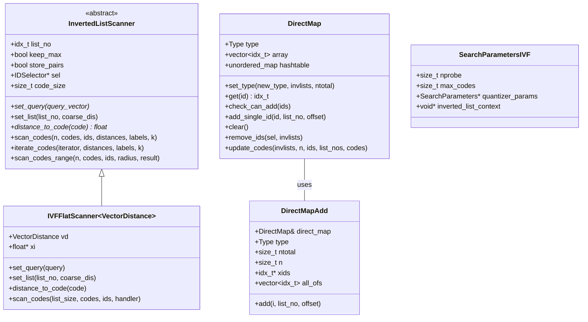
```mermaid
classDiagram
    class InvertedListScanner {
        <<abstract>>
        +idx_t list_no
        +bool keep_max
        +bool store_pairs
        +IDSelector* sel
        +size_t code_size
        +set_query(query_vector)*
        +set_list(list_no, coarse_dis)
        +distance_to_code(code)* float
        +scan_codes(n, codes, ids, distances, labels, k)
        +iterate_codes(iterator, distances, labels, k)
        +scan_codes_range(n, codes, ids, radius, result)
    }
    
    class IVFFlatScanner~VectorDistance~ {
        +VectorDistance vd
        +float* xi
        +set_query(query)
        +set_list(list_no, coarse_dis)
        +distance_to_code(code)
        +scan_codes(list_size, codes, ids, handler)
    }
    
    class DirectMap {
        +Type type
        +vector~idx_t~ array
        +unordered_map hashtable
        +set_type(new_type, invlists, ntotal)
        +get(id) idx_t
        +check_can_add(ids)
        +add_single_id(id, list_no, offset)
        +clear()
        +remove_ids(sel, invlists)
        +update_codes(invlists, n, ids, list_nos, codes)
    }
    
    class DirectMapAdd {
        +DirectMap& direct_map
        +Type type
        +size_t ntotal
        +size_t n
        +idx_t* xids
        +vector~idx_t~ all_ofs
        +add(i, list_no, offset)
    }
    
    class SearchParametersIVF {
        +size_t nprobe
        +size_t max_codes
        +SearchParameters* quantizer_params
        +void* inverted_list_context
    }
    
    InvertedListScanner <|-- IVFFlatScanner
    DirectMap -- DirectMapAdd : uses
```

### Component Relationship Diagram

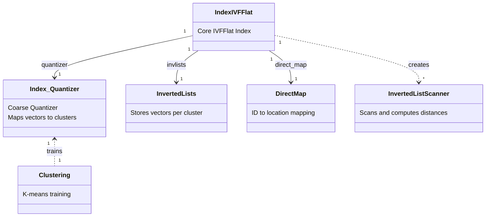
```mermaid
classDiagram
    class IndexIVFFlat {
        Core IVFFlat Index
    }
    
    class Index_Quantizer {
        Coarse Quantizer
        Maps vectors to clusters
    }
    
    class InvertedLists {
        Stores vectors per cluster
    }
    
    class DirectMap {
        ID to location mapping
    }
    
    class InvertedListScanner {
        Scans and computes distances
    }
    
    class Clustering {
        K-means training
    }
    
    IndexIVFFlat "1" --> "1" Index_Quantizer : quantizer
    IndexIVFFlat "1" --> "1" InvertedLists : invlists
    IndexIVFFlat "1" --> "1" DirectMap : direct_map
    IndexIVFFlat "1" ..> "*" InvertedListScanner : creates
    Index_Quantizer "1" <.. "1" Clustering : trains
```

---

## 4. Component Details

### 4.1 Level1Quantizer

The `Level1Quantizer` encapsulates the coarse quantization logic that maps vectors to cluster IDs (inverted list numbers).

**Key Responsibilities:**
- Owns or references the quantizer index (typically `IndexFlat`)
- Trains the quantizer using k-means clustering
- Encodes and decodes list numbers

**Training Modes (`quantizer_trains_alone`):**
- `0`: Use k-means clustering via the `Clustering` class
- `1`: Pass training data directly to the quantizer's `train()` method
- `2`: K-means on a flat index, then add centroids to the quantizer

### 4.2 IndexIVF

The base class for all IVF-based indices. It provides:

**Core Functionality:**
- Training pipeline (quantizer + optional encoder training)
- Vector addition with coarse quantization
- Multi-probe search with parallelization
- ID management via `DirectMap`

**Parallel Modes:**
- Mode 0: Split queries across threads
- Mode 1: Parallelize over inverted lists
- Mode 2: Parallelize over both
- Mode 3: Finer query granularity

### 4.3 IndexIVFFlat

The concrete implementation for IVF with flat (uncompressed) vector storage.

**Key Characteristics:**
- `code_size = sizeof(float) * d` (stores full vectors)
- `by_residual = false` (stores actual vectors, not residuals)
- Simple encoding: direct memory copy
- Exact distance computation within clusters

**Code Snippet - Constructor:**
```cpp
IndexIVFFlat::IndexIVFFlat(
        Index* quantizer,
        size_t d,
        size_t nlist,
        MetricType metric,
        bool own_invlists)
        : IndexIVF(quantizer, d, nlist, sizeof(float) * d, metric, own_invlists) {
    code_size = sizeof(float) * d;
    by_residual = false;
}
```

### 4.4 IVFFlatScanner

The scanner that computes distances during search.

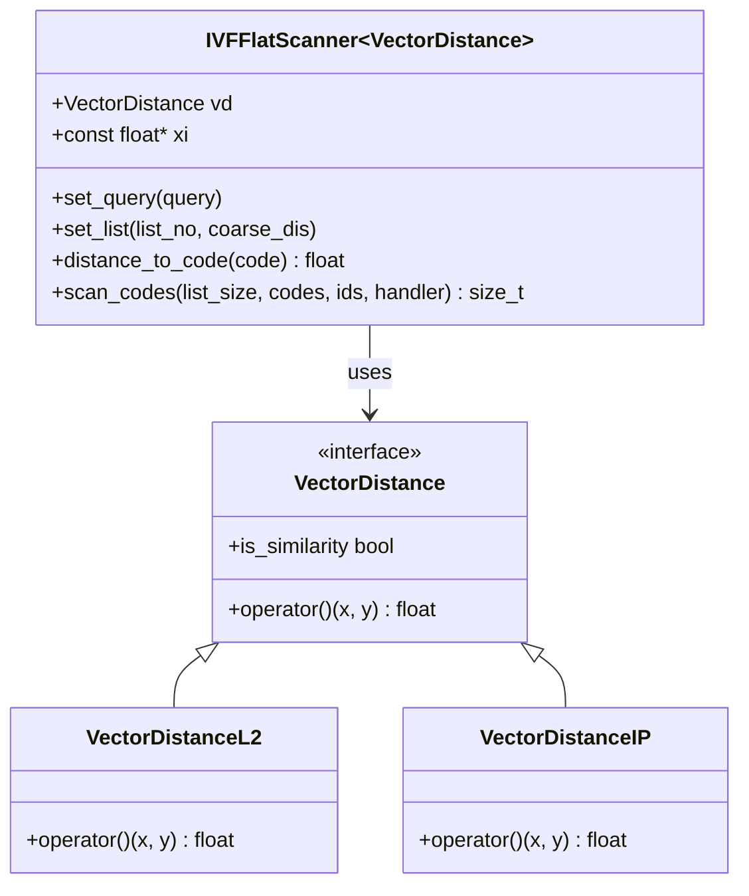
```mermaid
classDiagram
    class IVFFlatScanner~VectorDistance~ {
        +VectorDistance vd
        +const float* xi
        +set_query(query)
        +set_list(list_no, coarse_dis)
        +distance_to_code(code) float
        +scan_codes(list_size, codes, ids, handler) size_t
    }
    
    class VectorDistance {
        <<interface>>
        +operator()(x, y) float
        +is_similarity bool
    }
    
    class VectorDistanceL2 {
        +operator()(x, y) float
    }
    
    class VectorDistanceIP {
        +operator()(x, y) float
    }
    
    IVFFlatScanner --> VectorDistance : uses
    VectorDistance <|-- VectorDistanceL2
    VectorDistance <|-- VectorDistanceIP
```

---

## 5. Operation Flowcharts

### 5.1 Training Flowchart

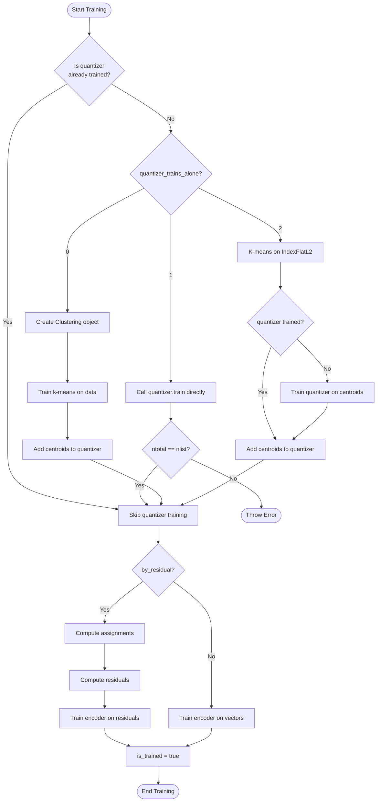
```mermaid
flowchart TD
    Start([Start Training]) --> Check{Is quantizer<br/>already trained?}
    Check -->|Yes| SkipQ[Skip quantizer training]
    Check -->|No| TrainMode{quantizer_trains_alone?}
    
    TrainMode -->|0| KMeans[Create Clustering object]
    KMeans --> ClusterTrain[Train k-means on data]
    ClusterTrain --> AddCentroids[Add centroids to quantizer]
    
    TrainMode -->|1| DirectTrain[Call quantizer.train directly]
    DirectTrain --> VerifyNlist{ntotal == nlist?}
    VerifyNlist -->|No| Error([Throw Error])
    VerifyNlist -->|Yes| SkipQ
    
    TrainMode -->|2| FlatKMeans[K-means on IndexFlatL2]
    FlatKMeans --> TrainQ{quantizer trained?}
    TrainQ -->|No| TrainOnCentroids[Train quantizer on centroids]
    TrainQ -->|Yes| AddCent2[Add centroids to quantizer]
    TrainOnCentroids --> AddCent2
    
    AddCentroids --> SkipQ
    AddCent2 --> SkipQ
    
    SkipQ --> ByRes{by_residual?}
    ByRes -->|Yes| ComputeAssign[Compute assignments]
    ComputeAssign --> ComputeResidual[Compute residuals]
    ComputeResidual --> TrainEncoder[Train encoder on residuals]
    
    ByRes -->|No| TrainEncoderDirect[Train encoder on vectors]
    
    TrainEncoder --> SetTrained[is_trained = true]
    TrainEncoderDirect --> SetTrained
    SetTrained --> End([End Training])
```

### 5.2 Add Vectors Flowchart

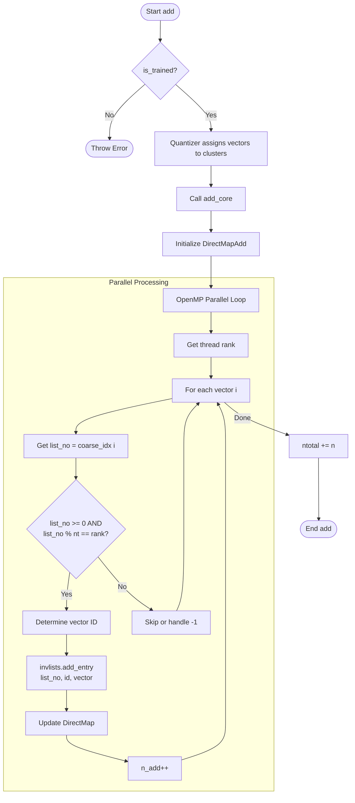
```mermaid
flowchart TD
    Start([Start add]) --> CheckTrained{is_trained?}
    CheckTrained -->|No| Error([Throw Error])
    CheckTrained -->|Yes| Quantize[Quantizer assigns vectors to clusters]
    
    Quantize --> CallAddCore[Call add_core]
    CallAddCore --> PrepareLoop[Initialize DirectMapAdd]
    
    PrepareLoop --> ParallelLoop[OpenMP Parallel Loop]
    
    subgraph ParallelProcessing["Parallel Processing"]
        ParallelLoop --> GetThread[Get thread rank]
        GetThread --> ForEach[For each vector i]
        ForEach --> GetList[Get list_no = coarse_idx i]
        GetList --> CheckList{list_no >= 0 AND<br/>list_no % nt == rank?}
        CheckList -->|Yes| GetID[Determine vector ID]
        GetID --> AddEntry[invlists.add_entry<br/>list_no, id, vector]
        AddEntry --> UpdateDM[Update DirectMap]
        UpdateDM --> IncrementCount[n_add++]
        IncrementCount --> ForEach
        CheckList -->|No| SkipOrDefault[Skip or handle -1]
        SkipOrDefault --> ForEach
    end
    
    ForEach --> |Done| UpdateTotal[ntotal += n]
    UpdateTotal --> End([End add])
```

### 5.3 Search Flowchart

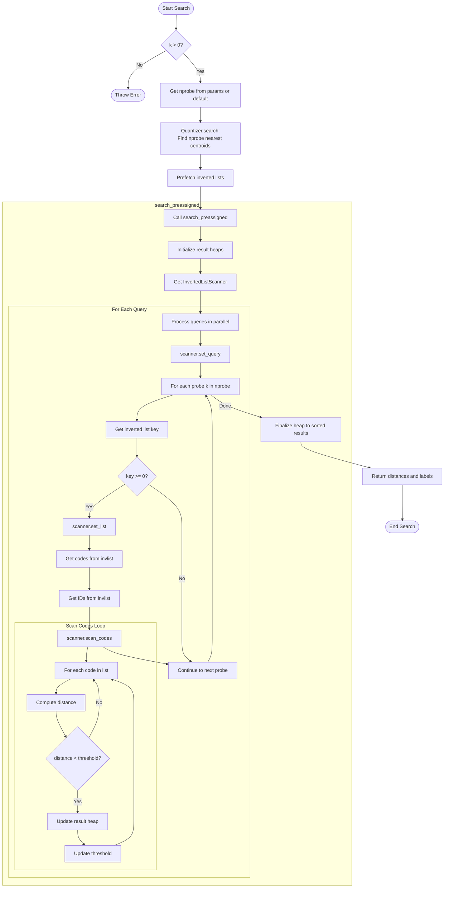
```mermaid
flowchart TD
    Start([Start Search]) --> ValidateK{k > 0?}
    ValidateK -->|No| Error([Throw Error])
    ValidateK -->|Yes| GetNprobe[Get nprobe from params or default]
    
    GetNprobe --> QuantizerSearch[Quantizer.search:<br/>Find nprobe nearest centroids]
    QuantizerSearch --> PrefetchLists[Prefetch inverted lists]
    PrefetchLists --> CallSearchPreassigned[Call search_preassigned]
    
    subgraph SearchPreassigned["search_preassigned"]
        CallSearchPreassigned --> InitHeap[Initialize result heaps]
        InitHeap --> GetScanner[Get InvertedListScanner]
        
        GetScanner --> ParallelQueries[Process queries in parallel]
        
        subgraph QueryProcessing["For Each Query"]
            ParallelQueries --> SetQuery[scanner.set_query]
            SetQuery --> ForEachProbe[For each probe k in nprobe]
            ForEachProbe --> GetKey[Get inverted list key]
            GetKey --> CheckKey{key >= 0?}
            CheckKey -->|No| NextProbe[Continue to next probe]
            CheckKey -->|Yes| SetList[scanner.set_list]
            SetList --> GetCodes[Get codes from invlist]
            GetCodes --> GetIds[Get IDs from invlist]
            GetIds --> ScanCodes[scanner.scan_codes]
            
            subgraph ScanLoop["Scan Codes Loop"]
                ScanCodes --> ForEachCode[For each code in list]
                ForEachCode --> ComputeDist[Compute distance]
                ComputeDist --> CheckThreshold{distance < threshold?}
                CheckThreshold -->|Yes| UpdateHeap[Update result heap]
                UpdateHeap --> UpdateThreshold[Update threshold]
                UpdateThreshold --> ForEachCode
                CheckThreshold -->|No| ForEachCode
            end
            
            ScanCodes --> NextProbe
            NextProbe --> ForEachProbe
        end
        
        ForEachProbe --> |Done| FinalizeResults[Finalize heap to sorted results]
    end
    
    FinalizeResults --> ReturnResults[Return distances and labels]
    ReturnResults --> End([End Search])
```

### 5.4 Encode/Decode Vectors Flowchart (IndexIVFFlat)

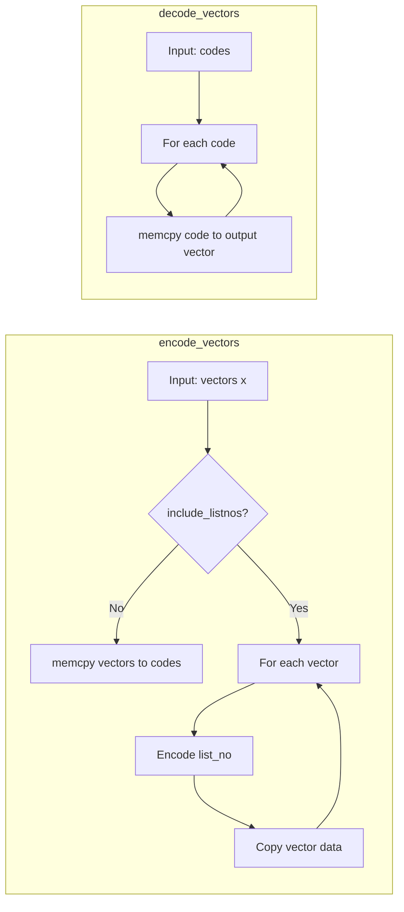
```mermaid
flowchart LR
    subgraph Encode["encode_vectors"]
        E1[Input: vectors x] --> E2{include_listnos?}
        E2 -->|No| E3[memcpy vectors to codes]
        E2 -->|Yes| E4[For each vector]
        E4 --> E5[Encode list_no]
        E5 --> E6[Copy vector data]
        E6 --> E4
    end
    
    subgraph Decode["decode_vectors"]
        D1[Input: codes] --> D2[For each code]
        D2 --> D3[memcpy code to output vector]
        D3 --> D2
    end
```

---

## 6. Sequence Diagrams

### 6.1 Training Sequence

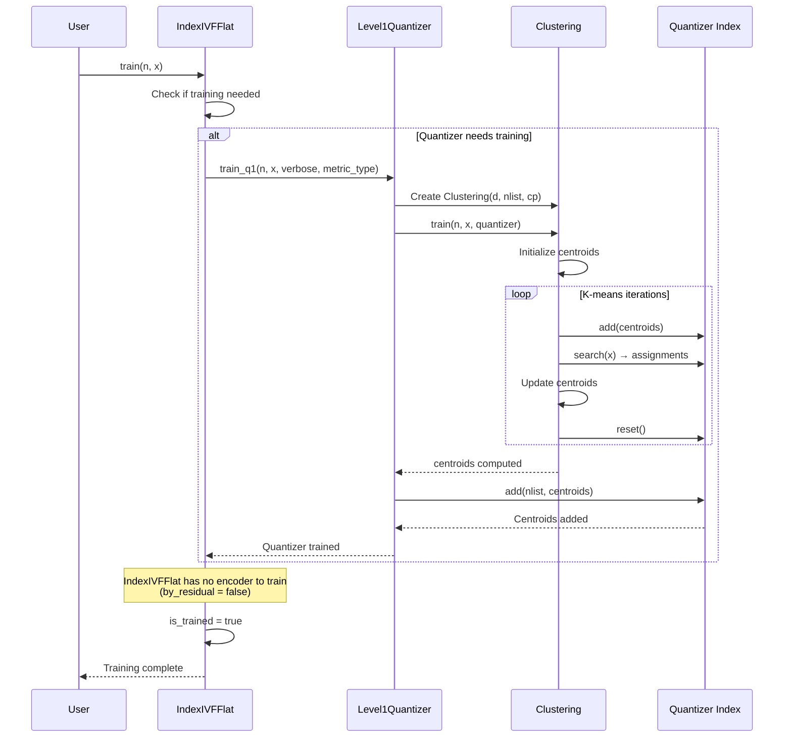
```mermaid
sequenceDiagram
    participant User
    participant IndexIVFFlat
    participant Level1Quantizer
    participant Clustering
    participant Quantizer as Quantizer Index
    
    User->>IndexIVFFlat: train(n, x)
    IndexIVFFlat->>IndexIVFFlat: Check if training needed
    
    alt Quantizer needs training
        IndexIVFFlat->>Level1Quantizer: train_q1(n, x, verbose, metric_type)
        Level1Quantizer->>Clustering: Create Clustering(d, nlist, cp)
        Level1Quantizer->>Clustering: train(n, x, quantizer)
        Clustering->>Clustering: Initialize centroids
        loop K-means iterations
            Clustering->>Quantizer: add(centroids)
            Clustering->>Quantizer: search(x) → assignments
            Clustering->>Clustering: Update centroids
            Clustering->>Quantizer: reset()
        end
        Clustering-->>Level1Quantizer: centroids computed
        Level1Quantizer->>Quantizer: add(nlist, centroids)
        Quantizer-->>Level1Quantizer: Centroids added
        Level1Quantizer-->>IndexIVFFlat: Quantizer trained
    end
    
    Note over IndexIVFFlat: IndexIVFFlat has no encoder to train<br/>(by_residual = false)
    
    IndexIVFFlat->>IndexIVFFlat: is_trained = true
    IndexIVFFlat-->>User: Training complete
```

### 6.2 Add Vectors Sequence

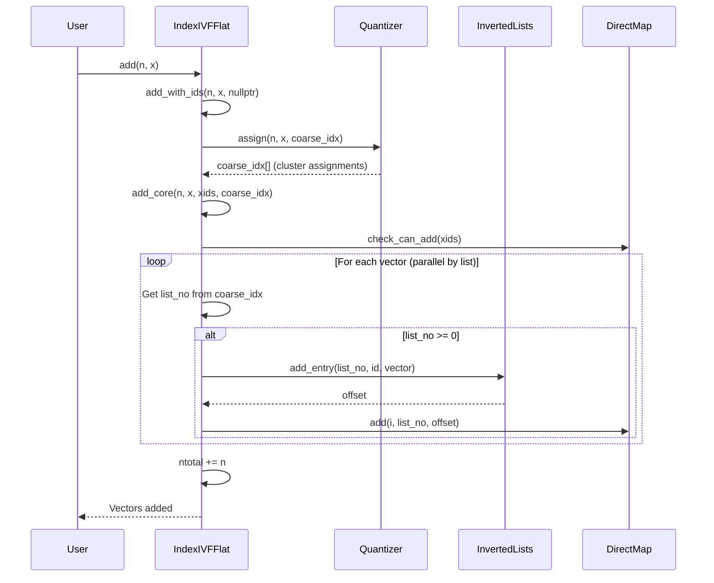
```mermaid
sequenceDiagram
    participant User
    participant IndexIVFFlat
    participant Quantizer
    participant InvertedLists
    participant DirectMap
    
    User->>IndexIVFFlat: add(n, x)
    IndexIVFFlat->>IndexIVFFlat: add_with_ids(n, x, nullptr)
    IndexIVFFlat->>Quantizer: assign(n, x, coarse_idx)
    Quantizer-->>IndexIVFFlat: coarse_idx[] (cluster assignments)
    
    IndexIVFFlat->>IndexIVFFlat: add_core(n, x, xids, coarse_idx)
    IndexIVFFlat->>DirectMap: check_can_add(xids)
    
    loop For each vector (parallel by list)
        IndexIVFFlat->>IndexIVFFlat: Get list_no from coarse_idx
        alt list_no >= 0
            IndexIVFFlat->>InvertedLists: add_entry(list_no, id, vector)
            InvertedLists-->>IndexIVFFlat: offset
            IndexIVFFlat->>DirectMap: add(i, list_no, offset)
        end
    end
    
    IndexIVFFlat->>IndexIVFFlat: ntotal += n
    IndexIVFFlat-->>User: Vectors added
```

### 6.3 Search Sequence

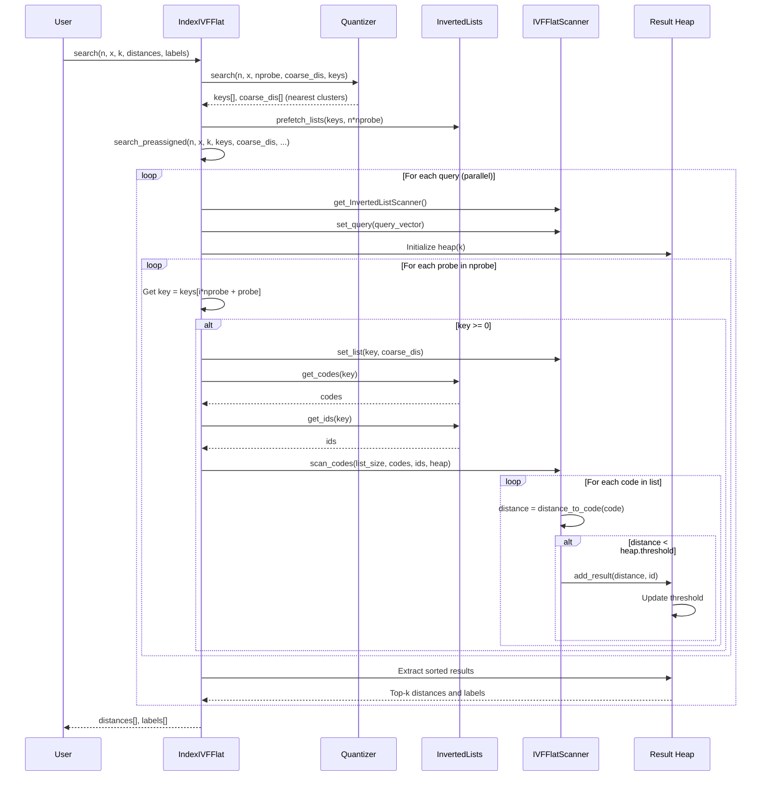
```mermaid
sequenceDiagram
    participant User
    participant IndexIVFFlat
    participant Quantizer
    participant InvertedLists
    participant Scanner as IVFFlatScanner
    participant Heap as Result Heap
    
    User->>IndexIVFFlat: search(n, x, k, distances, labels)
    IndexIVFFlat->>Quantizer: search(n, x, nprobe, coarse_dis, keys)
    Quantizer-->>IndexIVFFlat: keys[], coarse_dis[] (nearest clusters)
    
    IndexIVFFlat->>InvertedLists: prefetch_lists(keys, n*nprobe)
    
    IndexIVFFlat->>IndexIVFFlat: search_preassigned(n, x, k, keys, coarse_dis, ...)
    
    loop For each query (parallel)
        IndexIVFFlat->>Scanner: get_InvertedListScanner()
        IndexIVFFlat->>Scanner: set_query(query_vector)
        IndexIVFFlat->>Heap: Initialize heap(k)
        
        loop For each probe in nprobe
            IndexIVFFlat->>IndexIVFFlat: Get key = keys[i*nprobe + probe]
            alt key >= 0
                IndexIVFFlat->>Scanner: set_list(key, coarse_dis)
                IndexIVFFlat->>InvertedLists: get_codes(key)
                InvertedLists-->>IndexIVFFlat: codes
                IndexIVFFlat->>InvertedLists: get_ids(key)
                InvertedLists-->>IndexIVFFlat: ids
                
                IndexIVFFlat->>Scanner: scan_codes(list_size, codes, ids, heap)
                
                loop For each code in list
                    Scanner->>Scanner: distance = distance_to_code(code)
                    alt distance < heap.threshold
                        Scanner->>Heap: add_result(distance, id)
                        Heap->>Heap: Update threshold
                    end
                end
            end
        end
        
        IndexIVFFlat->>Heap: Extract sorted results
        Heap-->>IndexIVFFlat: Top-k distances and labels
    end
    
    IndexIVFFlat-->>User: distances[], labels[]
```

### 6.4 Reconstruction Sequence

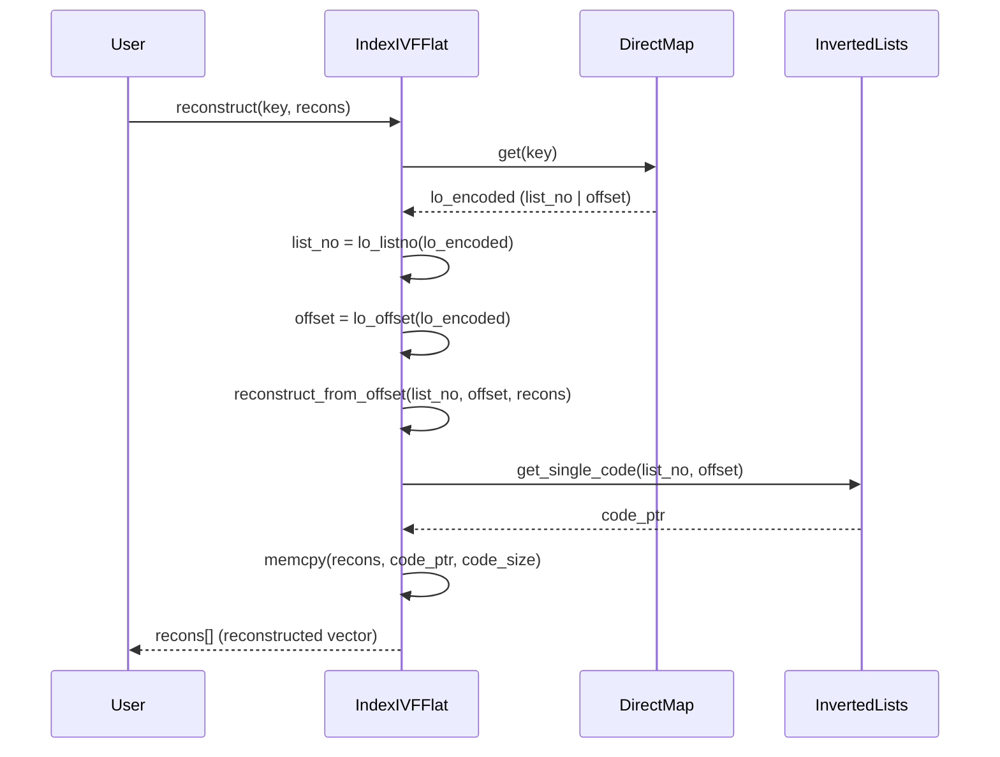
```mermaid
sequenceDiagram
    participant User
    participant IndexIVFFlat
    participant DirectMap
    participant InvertedLists
    
    User->>IndexIVFFlat: reconstruct(key, recons)
    IndexIVFFlat->>DirectMap: get(key)
    DirectMap-->>IndexIVFFlat: lo_encoded (list_no | offset)
    
    IndexIVFFlat->>IndexIVFFlat: list_no = lo_listno(lo_encoded)
    IndexIVFFlat->>IndexIVFFlat: offset = lo_offset(lo_encoded)
    
    IndexIVFFlat->>IndexIVFFlat: reconstruct_from_offset(list_no, offset, recons)
    IndexIVFFlat->>InvertedLists: get_single_code(list_no, offset)
    InvertedLists-->>IndexIVFFlat: code_ptr
    IndexIVFFlat->>IndexIVFFlat: memcpy(recons, code_ptr, code_size)
    IndexIVFFlat-->>User: recons[] (reconstructed vector)
```

---

## 7. Data Structures

### 7.1 ArrayInvertedLists Storage

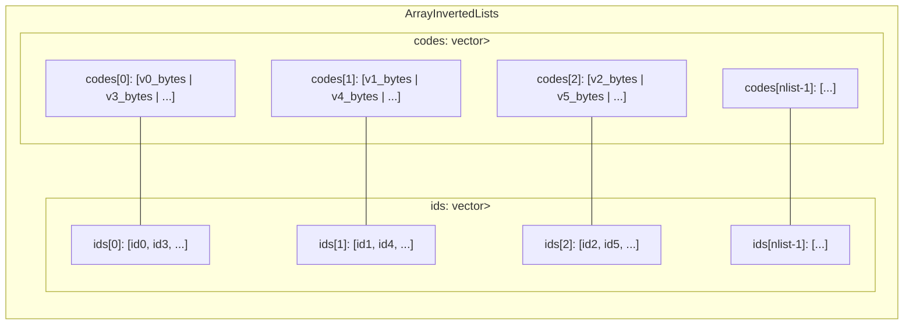
```mermaid
graph TB
    subgraph ArrayInvertedLists["ArrayInvertedLists"]
        direction TB
        
        subgraph Codes["codes: vector<MaybeOwnedVector<uint8_t>>"]
            C0["codes[0]: [v0_bytes | v3_bytes | ...]"]
            C1["codes[1]: [v1_bytes | v4_bytes | ...]"]
            C2["codes[2]: [v2_bytes | v5_bytes | ...]"]
            CN["codes[nlist-1]: [...]"]
        end
        
        subgraph IDs["ids: vector<MaybeOwnedVector<idx_t>>"]
            I0["ids[0]: [id0, id3, ...]"]
            I1["ids[1]: [id1, id4, ...]"]
            I2["ids[2]: [id2, id5, ...]"]
            IN["ids[nlist-1]: [...]"]
        end
        
        C0 --- I0
        C1 --- I1
        C2 --- I2
        CN --- IN
    end
```

### 7.2 DirectMap Types

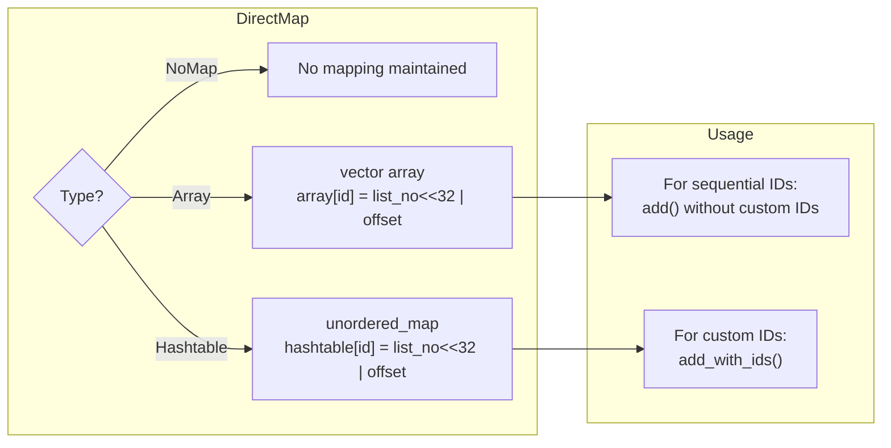
```mermaid
graph LR
    subgraph DirectMap["DirectMap"]
        Type{Type?}
        
        Type -->|NoMap| NoMap["No mapping maintained"]
        Type -->|Array| Array["vector<idx_t> array<br/>array[id] = list_no<<32 | offset"]
        Type -->|Hashtable| Hash["unordered_map<idx_t, idx_t><br/>hashtable[id] = list_no<<32 | offset"]
    end
    
    subgraph Usage["Usage"]
        Array --> Sequential["For sequential IDs:<br/>add() without custom IDs"]
        Hash --> Custom["For custom IDs:<br/>add_with_ids()"]
    end
```

### 7.3 Memory Layout for IVFFlat

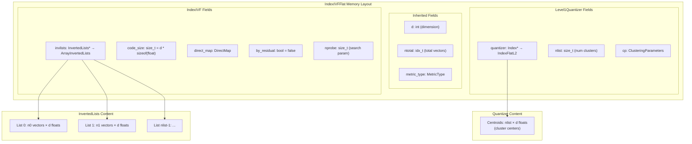
```mermaid
graph TB
    subgraph IndexIVFFlat["IndexIVFFlat Memory Layout"]
        direction TB
        
        subgraph BaseFields["Inherited Fields"]
            d["d: int (dimension)"]
            ntotal["ntotal: idx_t (total vectors)"]
            metric["metric_type: MetricType"]
        end
        
        subgraph L1Q["Level1Quantizer Fields"]
            quantizer["quantizer: Index* → IndexFlatL2"]
            nlist["nlist: size_t (num clusters)"]
            cp["cp: ClusteringParameters"]
        end
        
        subgraph IVFFields["IndexIVF Fields"]
            invlists["invlists: InvertedLists* → ArrayInvertedLists"]
            code_size["code_size: size_t = d * sizeof(float)"]
            direct_map["direct_map: DirectMap"]
            by_residual["by_residual: bool = false"]
            nprobe["nprobe: size_t (search param)"]
        end
    end
    
    subgraph QuantizerContent["Quantizer Content"]
        centroids["Centroids: nlist × d floats<br/>(cluster centers)"]
    end
    
    subgraph InvListsContent["InvertedLists Content"]
        list0["List 0: n0 vectors × d floats"]
        list1["List 1: n1 vectors × d floats"]
        listN["List nlist-1: ..."]
    end
    
    quantizer --> centroids
    invlists --> list0
    invlists --> list1
    invlists --> listN
```

---

## 8. Performance Considerations

### 8.1 Complexity Analysis

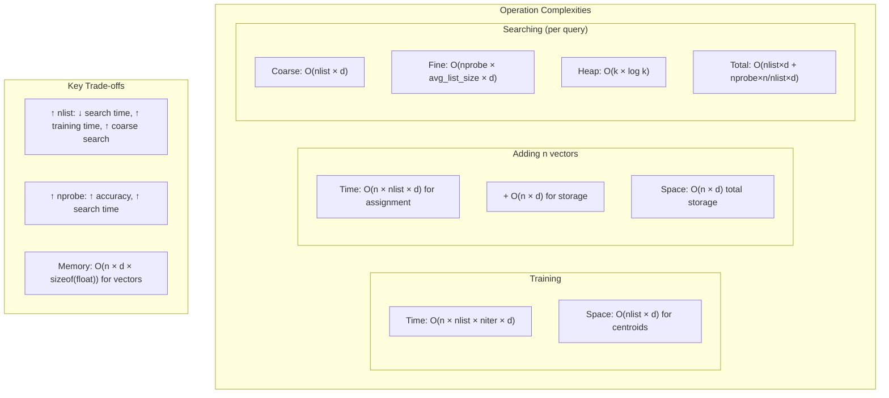
```mermaid
graph TB
    subgraph Operations["Operation Complexities"]
        subgraph Training["Training"]
            T1["Time: O(n × nlist × niter × d)"]
            T2["Space: O(nlist × d) for centroids"]
        end
        
        subgraph Adding["Adding n vectors"]
            A1["Time: O(n × nlist × d) for assignment"]
            A2["+ O(n × d) for storage"]
            A3["Space: O(n × d) total storage"]
        end
        
        subgraph Searching["Searching (per query)"]
            S1["Coarse: O(nlist × d)"]
            S2["Fine: O(nprobe × avg_list_size × d)"]
            S3["Heap: O(k × log k)"]
            S4["Total: O(nlist×d + nprobe×n/nlist×d)"]
        end
    end
    
    subgraph Tradeoffs["Key Trade-offs"]
        nlist_effect["↑ nlist: ↓ search time, ↑ training time, ↑ coarse search"]
        nprobe_effect["↑ nprobe: ↑ accuracy, ↑ search time"]
        memory["Memory: O(n × d × sizeof(float)) for vectors"]
    end
```

### 8.2 Optimal Parameter Selection

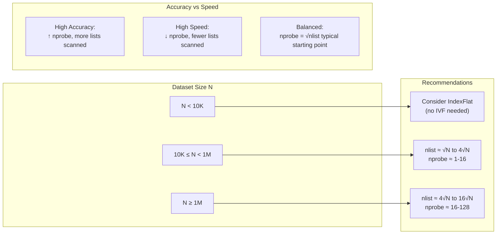
```mermaid
graph LR
    subgraph DatasetSize["Dataset Size N"]
        Small["N < 10K"]
        Medium["10K ≤ N < 1M"]
        Large["N ≥ 1M"]
    end
    
    subgraph Recommendations["Recommendations"]
        Small --> SmallRec["Consider IndexFlat<br/>(no IVF needed)"]
        Medium --> MedRec["nlist ≈ √N to 4√N<br/>nprobe ≈ 1-16"]
        Large --> LargeRec["nlist ≈ 4√N to 16√N<br/>nprobe ≈ 16-128"]
    end
    
    subgraph AccuracySpeed["Accuracy vs Speed"]
        direction TB
        HighAcc["High Accuracy:<br/>↑ nprobe, more lists scanned"]
        HighSpeed["High Speed:<br/>↓ nprobe, fewer lists scanned"]
        Balance["Balanced:<br/>nprobe = √nlist typical starting point"]
    end
```

### 8.3 Parallelization Strategy

```mermaid
flowchart TD
    subgraph ParallelModes["Parallel Modes"]
        Mode0["Mode 0 (default):<br/>Parallelize over queries"]
        Mode1["Mode 1:<br/>Parallelize over inverted lists"]
        Mode2["Mode 2:<br/>Parallelize over both"]
        Mode3["Mode 3:<br/>Finer query granularity"]
    end
    
    subgraph BestFor["Best Use Cases"]
        Mode0 --> Many["Many queries, moderate nprobe"]
        Mode1 --> Few["Few queries, large lists"]
        Mode2 --> Both["Hybrid workloads"]
        Mode3 --> FineGrained["Need finer control"]
    end
```

---

## Summary

The IVFFlat index in FAISS provides an efficient approximate nearest neighbor search by:

1. **Partitioning** the vector space into `nlist` clusters using k-means
2. **Storing** vectors in their original form within inverted lists
3. **Searching** only `nprobe` most relevant clusters for each query
4. **Computing** exact distances within the selected clusters

**Key Classes:**
- `IndexIVFFlat`: Main index class
- `Level1Quantizer`: Manages cluster centroids and assignments
- `InvertedLists`: Stores vectors organized by cluster
- `InvertedListScanner`: Computes distances during search
- `DirectMap`: Maps vector IDs to storage locations

**Key Trade-offs:**
- `nlist`: More clusters = faster search but more quantization error
- `nprobe`: More probes = better accuracy but slower search
- Memory: Full vector storage (no compression)

This makes IVFFlat ideal when you need fast approximate search with high accuracy and can afford the memory for storing uncompressed vectors.
