# FAISS IVFPQ Implementation Details

## Table of Contents
1. [Introduction to Inverted File with Product Quantization](#1-introduction-to-inverted-file-with-product-quantization)
2. [Product Quantization Fundamentals](#2-product-quantization-fundamentals)
3. [IVFPQ Conceptual Overview](#3-ivfpq-conceptual-overview)
4. [Class Hierarchy and UML Diagrams](#4-class-hierarchy-and-uml-diagrams)
5. [Component Details](#5-component-details)
6. [Operation Flowcharts](#6-operation-flowcharts)
7. [Sequence Diagrams](#7-sequence-diagrams)
8. [Distance Computation](#8-distance-computation)
9. [Data Structures](#9-data-structures)
10. [Performance Considerations](#10-performance-considerations)

---

## 1. Introduction to Inverted File with Product Quantization

### What is IVFPQ?

**IVFPQ** (Inverted File with Product Quantization) is one of the most important and widely used approximate nearest neighbor (ANN) search algorithms in FAISS. It combines two powerful techniques:

1. **Inverted File (IVF)**: Partitions the vector space into clusters for non-exhaustive search
2. **Product Quantization (PQ)**: Compresses vectors into compact codes for memory efficiency

### Why Use IVFPQ?

IVFPQ is the workhorse of billion-scale similarity search because it provides:

- **Memory Efficiency**: Compresses d-dimensional vectors to just M bytes (typically 8-64 bytes)
- **Speed**: Combines IVF's cluster-based search with efficient table-based distance computation
- **Scalability**: Can handle billions of vectors on a single machine
- **Tunable Trade-offs**: Parameters allow fine control over memory/speed/accuracy

### Compression Example

```
Original vector:    128 floats × 4 bytes = 512 bytes
With PQ (M=8, 8bit): 8 bytes
Compression ratio:  64× reduction!
```

---

## 2. Product Quantization Fundamentals

### The Core Idea

Product Quantization divides a d-dimensional vector into M equal sub-vectors, then quantizes each sub-vector independently using its own codebook of k=2^nbits centroids.

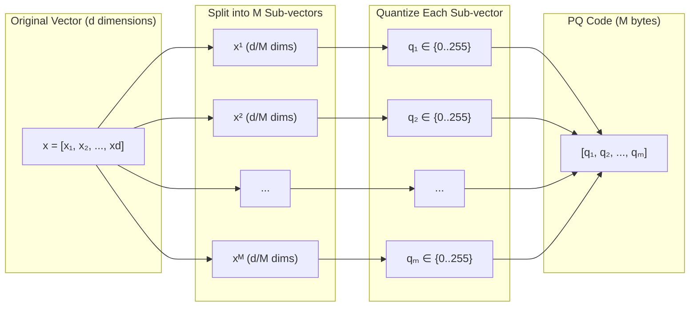

### PQ Parameters

| Parameter | Description | Typical Values |
|-----------|-------------|----------------|
| `d` | Vector dimension | 64, 128, 256, etc. |
| `M` | Number of sub-quantizers | 8, 16, 32, 64 |
| `nbits` | Bits per sub-quantizer index | 8 (256 centroids), rarely 4 or 16 |
| `dsub` | Sub-vector dimension (d/M) | 8, 16, etc. |
| `ksub` | Centroids per sub-quantizer (2^nbits) | 256 (for nbits=8) |

### Codebook Structure

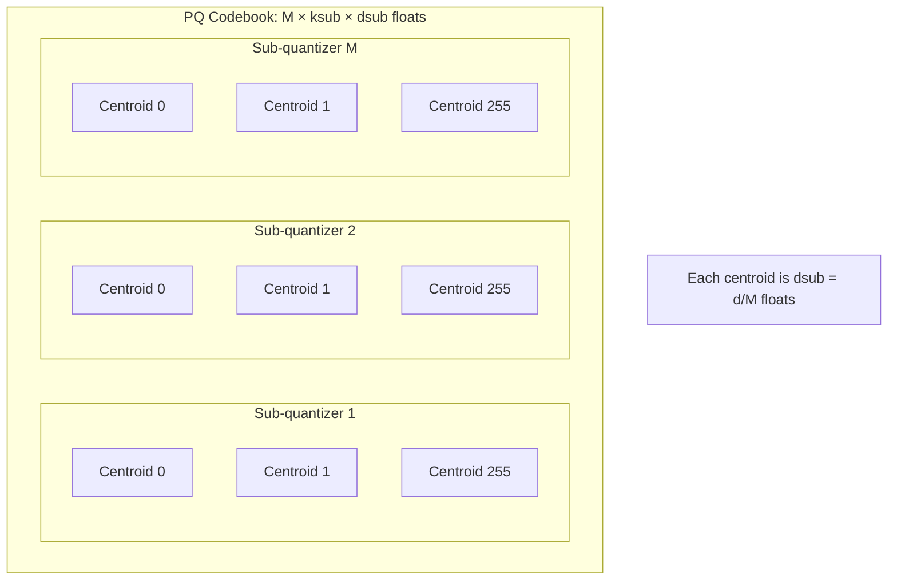

---

## 3. IVFPQ Conceptual Overview

### How IVFPQ Works

IVFPQ uses a two-level quantization approach:

1. **Coarse Quantization (IVF)**: Assigns vectors to one of nlist clusters
2. **Fine Quantization (PQ)**: Encodes the residual (vector - centroid) using PQ

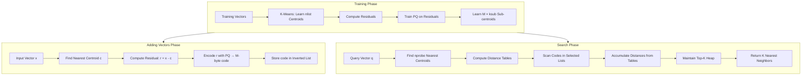

### The Residual Encoding (by_residual = true)

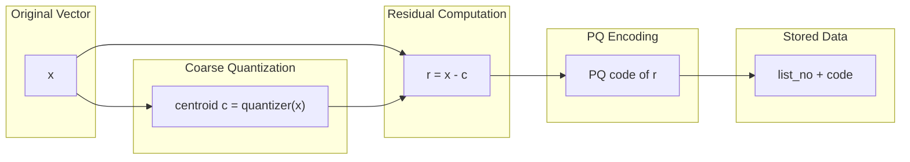

### Key Parameters

| Parameter | Description | Typical Values |
|-----------|-------------|----------------|
| `nlist` | Number of IVF clusters | 256 to 65536 |
| `nprobe` | Clusters to search | 1 to 256 |
| `M` | PQ sub-quantizers | 8, 16, 32 |
| `nbits` | Bits per code | 8 (standard) |
| `by_residual` | Encode residuals vs raw vectors | true (recommended) |
| `use_precomputed_table` | Precompute distance terms | 0, 1, or 2 |

---

## 4. Class Hierarchy and UML Diagrams

### Main Class Hierarchy

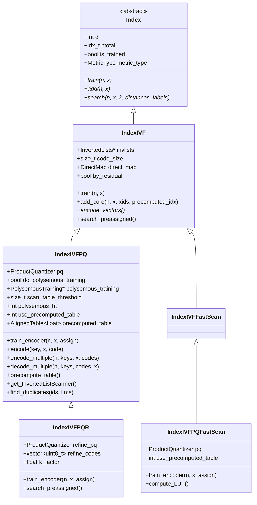

### ProductQuantizer Class

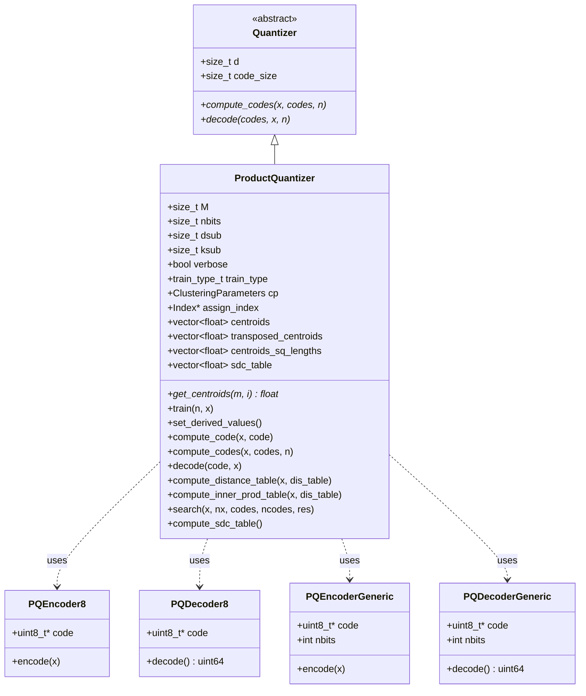

### Scanner and Query Tables

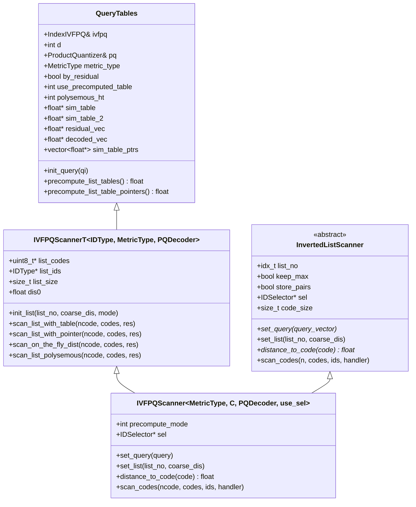

### Component Relationships

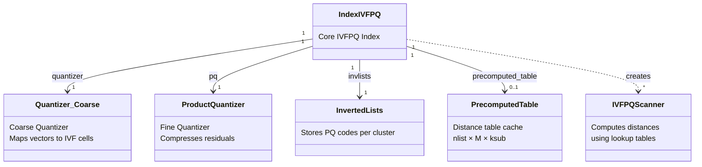

---

## 5. Component Details

### 5.1 ProductQuantizer

The `ProductQuantizer` is the heart of IVFPQ. It:
- Divides vectors into M sub-vectors
- Trains M independent codebooks using k-means
- Encodes/decodes vectors using the codebooks

**Training Modes:**
```cpp
enum train_type_t {
    Train_default,       // Standard k-means per subspace
    Train_hot_start,     // Use provided centroids as initialization
    Train_shared,        // Share one codebook across all subspaces
    Train_hypercube,     // Initialize with hypercube corners
    Train_hypercube_pca, // Initialize with PCA-rotated hypercube
};
```

**Key Methods:**

| Method | Description |
|--------|-------------|
| `train(n, x)` | Train M codebooks using k-means |
| `compute_code(x, code)` | Encode one vector |
| `decode(code, x)` | Decode one code to vector |
| `compute_distance_table(x, table)` | Precompute distances from x to all centroids |

### 5.2 IndexIVFPQ

The main index class that combines IVF and PQ:

**Key Characteristics:**
- `by_residual = true`: Encodes residuals (x - centroid) not raw vectors
- `code_size = M * nbits / 8`: Typically M bytes for nbits=8
- Supports polysemous filtering for faster search
- Can use precomputed tables for L2 search

**Precomputed Tables:**

For L2 search with residuals, the distance is:
```
d = ||x - y_C - y_R||²
  = ||x - y_C||² + ||y_R||² + 2*(y_C|y_R) - 2*(x|y_R)
    -----------   ---------------------------   -------
       term 1            term 2                 term 3
```

- Term 1: Coarse distance (from IVF search)
- Term 2: Can be precomputed (nlist × M × ksub table)
- Term 3: Computed per query (M × ksub table)

### 5.3 Distance Computation

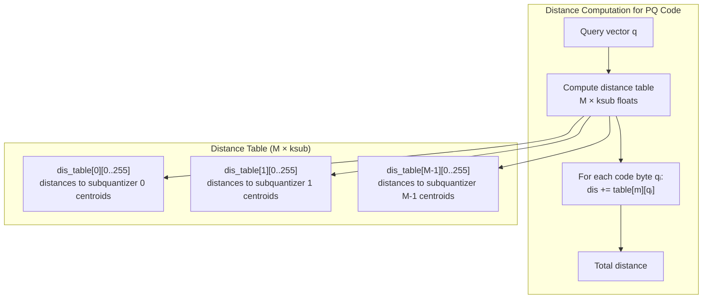

---

## 6. Operation Flowcharts

### 6.1 Training Flowchart

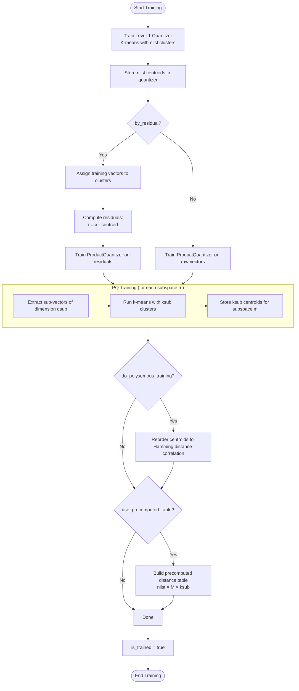

### 6.2 Add Vectors Flowchart

```mermaid
flowchart TD
    Start([Start add_core_o]) --> CheckTrained{is_trained?}
    CheckTrained -->|No| Error([Throw Error])
    CheckTrained -->|Yes| NeedAssign{precomputed_idx<br/>provided?}
    
    NeedAssign -->|No| Quantize[quantizer.assign → get cluster IDs]
    NeedAssign -->|Yes| UseIdx[Use provided cluster IDs]
    
    Quantize --> PrepareResiduals
    UseIdx --> PrepareResiduals
    
    PrepareResiduals{by_residual?}
    PrepareResiduals -->|Yes| ComputeRes[Compute residuals:<br/>r[i] = x[i] - centroid[idx[i]]]
    PrepareResiduals -->|No| UseRaw[to_encode = raw vectors]
    ComputeRes --> EncodePQ
    UseRaw --> EncodePQ
    
    EncodePQ[pq.compute_codes → M-byte codes]
    
    EncodePQ --> LoopVectors[For each vector i]
    
    subgraph AddLoop["Add to Inverted Lists"]
        LoopVectors --> GetKey[key = cluster ID]
        GetKey --> CheckKey{key >= 0?}
        CheckKey -->|No| SkipVec[Skip vector, update direct_map]
        CheckKey -->|Yes| AddEntry[invlists.add_entry<br/>key, id, PQ_code]
        AddEntry --> UpdateDM[Update DirectMap]
        UpdateDM --> ComputeRes2{Need 2nd residual?}
        ComputeRes2 -->|Yes| Decode[Decode PQ code<br/>residual_2 = original - decoded]
        ComputeRes2 -->|No| NextVec
        Decode --> NextVec[Next vector]
        SkipVec --> NextVec
    end
    
    NextVec --> |More vectors| LoopVectors
    NextVec --> |Done| UpdateTotal[ntotal += n]
    UpdateTotal --> End([End add])
```

### 6.3 Search Flowchart

```mermaid
flowchart TD
    Start([Start Search]) --> CoarseSearch[Quantizer search:<br/>Find nprobe nearest centroids]
    CoarseSearch --> InitTables[Initialize QueryTables]
    
    InitTables --> InitQuery[init_query: Compute query-specific tables]
    
    subgraph QueryInit["Query Initialization"]
        InitQuery --> MetricCheck{metric_type?}
        MetricCheck -->|IP| ComputeIP[compute_inner_prod_table<br/>→ sim_table]
        MetricCheck -->|L2| L2Check{by_residual AND<br/>use_precomputed?}
        L2Check -->|Yes| ComputeIP2[compute_inner_prod_table<br/>→ sim_table_2]
        L2Check -->|No| ComputeL2[compute_distance_table<br/>→ sim_table]
    end
    
    ComputeIP --> ProbeLoop
    ComputeIP2 --> ProbeLoop
    ComputeL2 --> ProbeLoop
    
    ProbeLoop[For each probe in nprobe]
    
    subgraph ListScan["Scan Inverted List"]
        ProbeLoop --> GetList[Get inverted list for centroid]
        GetList --> PrecompList[precompute_list_tables:<br/>Combine query + list tables]
        PrecompList --> GetCodes[Get codes and IDs from list]
        GetCodes --> ScanMethod{Scan method?}
        
        ScanMethod -->|Table| ScanTable[scan_list_with_table]
        ScanMethod -->|Pointer| ScanPointer[scan_list_with_pointer]
        ScanMethod -->|OnTheFly| ScanOTF[scan_on_the_fly_dist]
        ScanMethod -->|Polysemous| ScanPoly[scan_list_polysemous]
        
        subgraph TableScan["Table-based Scan (optimized)"]
            ScanTable --> BatchCodes[Process 4 codes at a time]
            BatchCodes --> LookupSum[For each code byte:<br/>dis += sim_table[m][code[m]]]
            LookupSum --> AddResult[Add to result heap if good]
        end
    end
    
    ScanTable --> NextProbe
    ScanPointer --> NextProbe
    ScanOTF --> NextProbe
    ScanPoly --> NextProbe
    
    NextProbe[Next probe] --> |More probes| ProbeLoop
    NextProbe --> |Done| FinalizeHeap[Finalize heap → sorted results]
    FinalizeHeap --> End([Return distances, labels])
```

### 6.4 PQ Encoding Flowchart

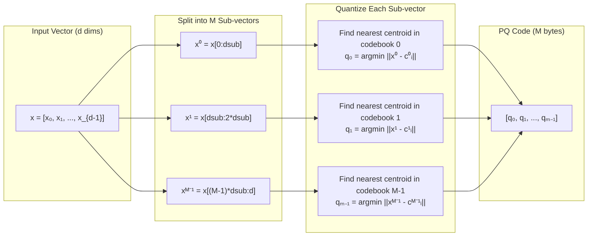

---

## 7. Sequence Diagrams

### 7.1 Training Sequence

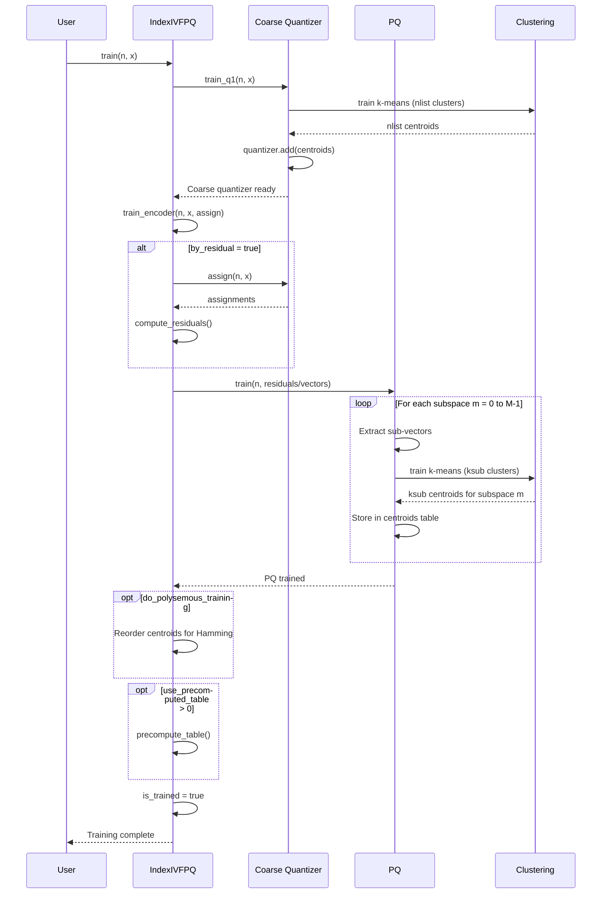

### 7.2 Add Vectors Sequence

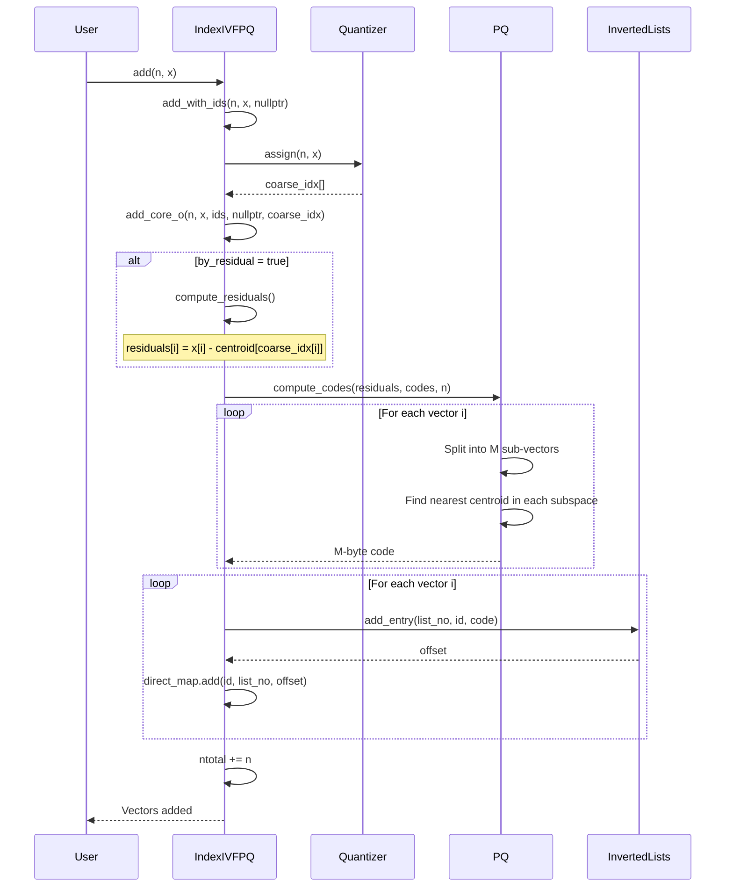

### 7.3 Search Sequence

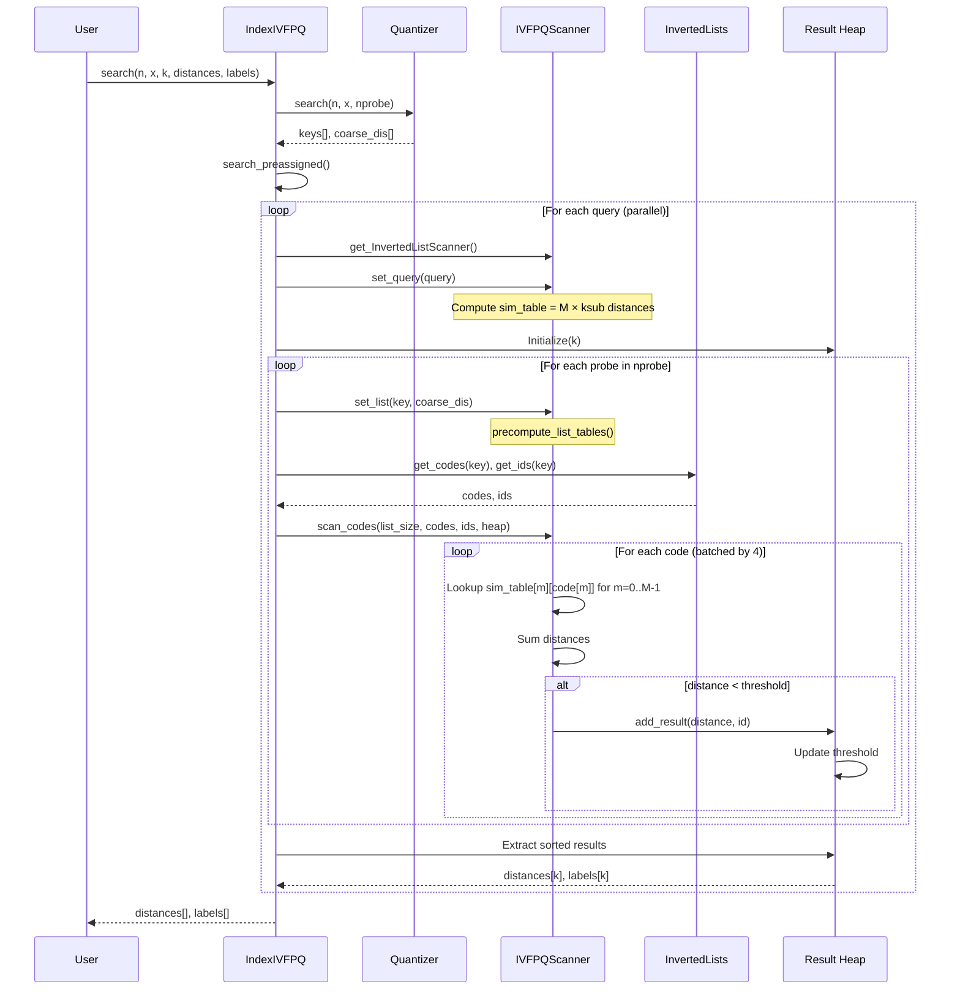

### 7.4 Reconstruction Sequence

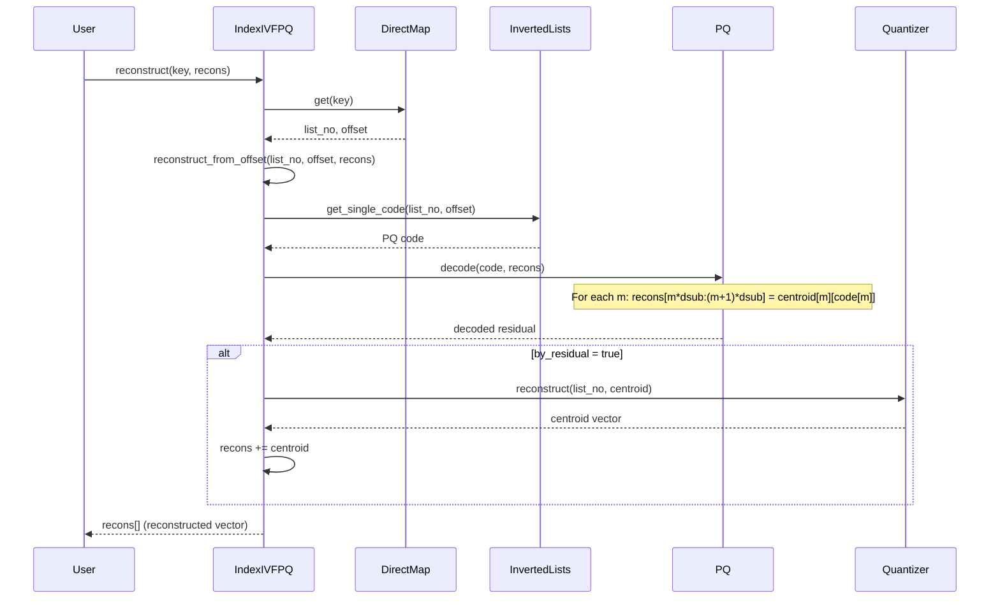

---

## 8. Distance Computation

### 8.1 Asymmetric Distance Computation (ADC)

In IVFPQ search, we use Asymmetric Distance Computation where:
- Query: full precision float vector
- Database: quantized PQ codes

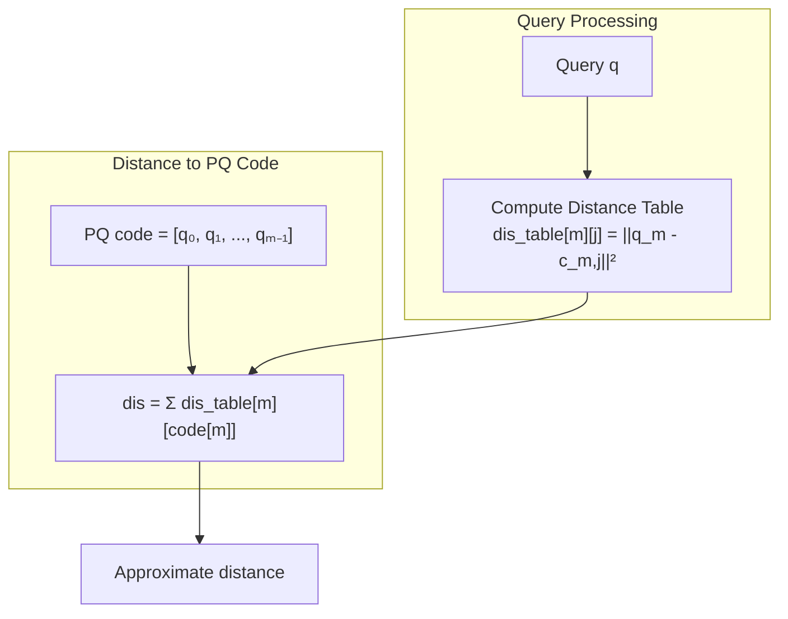

### 8.2 Distance with Residuals (by_residual = true)

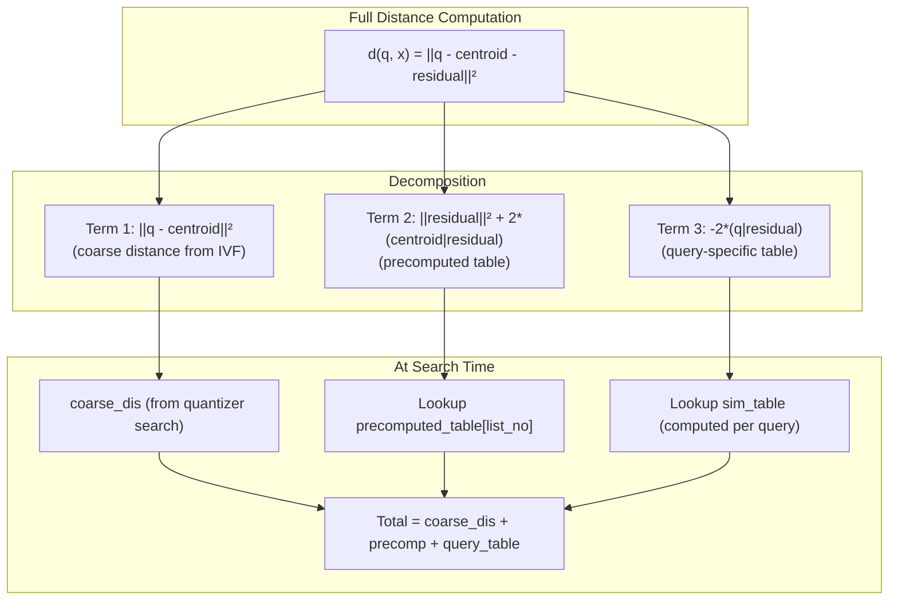

### 8.3 Polysemous Filtering

Polysemous filtering uses the PQ codes as binary codes for fast Hamming distance pre-filtering:

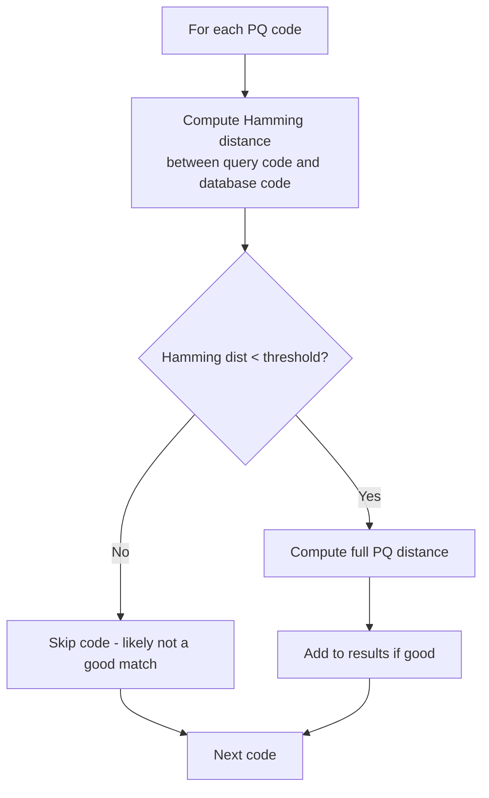

---

## 9. Data Structures

### 9.1 Memory Layout

```mermaid
graph TB
    subgraph IndexIVFPQ["IndexIVFPQ Memory Layout"]
        subgraph BaseFields["Base Fields"]
            d["d: dimension"]
            ntotal["ntotal: num vectors"]
            nlist["nlist: num clusters"]
        end
        
        subgraph PQFields["ProductQuantizer"]
            M["M: num sub-quantizers"]
            nbits["nbits: bits per index (8)"]
            dsub["dsub: d/M"]
            ksub["ksub: 2^nbits (256)"]
            centroids["centroids: M × ksub × dsub floats"]
        end
        
        subgraph InvLists["InvertedLists"]
            codes["codes[nlist]: PQ codes per list"]
            ids["ids[nlist]: vector IDs per list"]
        end
        
        subgraph PrecompTable["Precomputed Table (optional)"]
            table["nlist × M × ksub floats"]
        end
    end
```

### 9.2 PQ Codebook Layout

```mermaid
graph LR
    subgraph Centroids["centroids array: M × ksub × dsub"]
        subgraph M0["Subquantizer 0"]
            C0_0["c₀,₀ (dsub floats)"]
            C0_1["c₀,₁ (dsub floats)"]
            C0_255["c₀,₂₅₅ (dsub floats)"]
        end
        
        subgraph M1["Subquantizer 1"]
            C1_0["c₁,₀ (dsub floats)"]
            C1_1["c₁,₁ (dsub floats)"]
            C1_255["c₁,₂₅₅ (dsub floats)"]
        end
        
        subgraph MM["Subquantizer M-1"]
            CM_0["cₘ₋₁,₀ (dsub floats)"]
            CM_1["cₘ₋₁,₁ (dsub floats)"]
            CM_255["cₘ₋₁,₂₅₅ (dsub floats)"]
        end
    end
```

### 9.3 Inverted List Content for IVFPQ

```mermaid
graph TB
    subgraph InvertedList["Inverted List for Cluster i"]
        subgraph Codes["codes: n × M bytes"]
            Code0["Code 0: [q₀, q₁, ..., qₘ₋₁]"]
            Code1["Code 1: [q₀, q₁, ..., qₘ₋₁]"]
            CodeN["Code n-1: [q₀, q₁, ..., qₘ₋₁]"]
        end
        
        subgraph IDs["ids: n × 8 bytes"]
            ID0["Vector ID 0"]
            ID1["Vector ID 1"]
            IDN["Vector ID n-1"]
        end
        
        Code0 --- ID0
        Code1 --- ID1
        CodeN --- IDN
    end
```

### 9.4 Distance Table Layout

```mermaid
graph TB
    subgraph SimTable["sim_table: M × ksub floats"]
        subgraph Row0["Subquantizer 0"]
            D0_0["||q₀ - c₀,₀||²"]
            D0_1["||q₀ - c₀,₁||²"]
            D0_255["||q₀ - c₀,₂₅₅||²"]
        end
        
        subgraph Row1["Subquantizer 1"]
            D1_0["||q₁ - c₁,₀||²"]
            D1_1["||q₁ - c₁,₁||²"]
            D1_255["||q₁ - c₁,₂₅₅||²"]
        end
        
        subgraph RowM["Subquantizer M-1"]
            DM_0["||qₘ₋₁ - cₘ₋₁,₀||²"]
            DM_1["||qₘ₋₁ - cₘ₋₁,₁||²"]
            DM_255["||qₘ₋₁ - cₘ₋₁,₂₅₅||²"]
        end
    end
    
    subgraph Usage["Distance Computation"]
        CodeExample["Code = [42, 128, ..., 7]"]
        Computation["dis = sim_table[0][42] + sim_table[1][128] + ... + sim_table[M-1][7]"]
    end
    
    SimTable --> Computation
    CodeExample --> Computation
```

---

## 10. Performance Considerations

### 10.1 Complexity Analysis

```mermaid
graph TB
    subgraph Complexities["Operation Complexities"]
        subgraph Training["Training"]
            T1["Coarse: O(n × nlist × niter × d)"]
            T2["PQ: O(n × M × ksub × niter × dsub)"]
        end
        
        subgraph Adding["Adding n vectors"]
            A1["Coarse assign: O(n × nlist × d)"]
            A2["Residual: O(n × d)"]
            A3["PQ encode: O(n × M × ksub × dsub)"]
            A4["Storage: O(n × M) bytes"]
        end
        
        subgraph Search["Search (per query)"]
            S1["Coarse search: O(nlist × d)"]
            S2["Distance table: O(M × ksub × dsub)"]
            S3["Scan: O(nprobe × avg_list_size × M)"]
            S4["Table lookup: O(1) per code byte"]
        end
    end
```

### 10.2 Memory vs. Accuracy Trade-offs

```mermaid
graph LR
    subgraph Parameters["Parameter Impact"]
        M_high["↑ M (more sub-quantizers)"]
        M_low["↓ M (fewer sub-quantizers)"]
        
        nbits_high["↑ nbits (more centroids)"]
        nbits_low["↓ nbits (fewer centroids)"]
        
        nlist_high["↑ nlist (more clusters)"]
        nlist_low["↓ nlist (fewer clusters)"]
    end
    
    subgraph Effects["Effects"]
        M_high --> MH_acc["Better accuracy"]
        M_high --> MH_mem["More memory (M bytes/vec)"]
        
        M_low --> ML_acc["Lower accuracy"]
        M_low --> ML_mem["Less memory"]
        
        nbits_high --> NH_acc["Better subspace accuracy"]
        nbits_high --> NH_mem["Larger codebooks"]
        
        nlist_high --> NLH_speed["Faster search"]
        nlist_high --> NLH_acc["May hurt accuracy"]
    end
```

### 10.3 Optimal Parameter Selection

| Dataset Size | Recommended nlist | Recommended M | Memory per Vector |
|--------------|-------------------|---------------|-------------------|
| < 1M | 256 - 1024 | 8 - 16 | 8 - 16 bytes |
| 1M - 10M | 1024 - 4096 | 16 - 32 | 16 - 32 bytes |
| 10M - 100M | 4096 - 16384 | 32 - 64 | 32 - 64 bytes |
| > 100M | 16384 - 65536 | 64 | 64 bytes |

### 10.4 Search Speed Optimization

```mermaid
flowchart TD
    subgraph Optimizations["Speed Optimizations"]
        Precomp["use_precomputed_table = 1 or 2<br/>Pre-compute distance terms"]
        Batch["Process 4 codes at a time<br/>SIMD-friendly unrolling"]
        Polysemous["polysemous_ht > 0<br/>Hamming pre-filtering"]
        FastScan["IndexIVFPQFastScan<br/>SIMD-optimized scanning"]
    end
    
    subgraph WhenToUse["When to Use"]
        Precomp --> PrecompUse["L2 metric + by_residual<br/>Large nlist, small M×ksub×nlist"]
        Batch --> BatchUse["Always enabled internally"]
        Polysemous --> PolyUse["Very large lists<br/>Can tolerate some recall loss"]
        FastScan --> FastUse["4-bit PQ (nbits=4)<br/>Maximum throughput needed"]
    end
```

---

## Summary

IVFPQ is a sophisticated index that achieves remarkable compression and search speed through:

1. **Two-level Quantization**:
   - Coarse: IVF partitions space into nlist cells
   - Fine: PQ compresses residuals to M bytes

2. **Efficient Distance Computation**:
   - Precompute M × ksub distance table per query
   - O(M) lookups per code instead of O(d) computations

3. **Memory Efficiency**:
   - Original: d × 4 bytes per vector (e.g., 512 bytes for d=128)
   - IVFPQ: M bytes per vector (e.g., 16 bytes for M=16)
   - **32× compression** with reasonable accuracy

**Key Classes:**
- `IndexIVFPQ`: Main index combining IVF and PQ
- `ProductQuantizer`: Handles vector compression/decompression
- `IVFPQScanner`: Optimized distance computation with lookup tables
- `QueryTables`: Manages distance table computation

**Key Trade-offs:**
- `M`: More sub-quantizers = better accuracy but more memory
- `nbits`: Usually 8 (256 centroids) is optimal
- `nprobe`: More probes = better recall but slower
- `use_precomputed_table`: Trades memory for speed

IVFPQ is ideal for billion-scale search where memory is constrained but high recall is still needed.
