# Inverted File Index with Flat Quantizer (IVF-Flat) in FAISS

## 1. Introduction

The Inverted File Index with Flat Quantizer (IVF-Flat) is one of the most fundamental approximate nearest neighbor (ANN) search algorithms implemented in Facebook AI Similarity Search (FAISS). It combines **Voronoi partitioning** of the vector space with **exact distance computation** within selected partitions, achieving a practical balance between search speed and recall accuracy.

Unlike pure brute-force search, IVF-Flat narrows the search scope through spatial partitioning, and unlike heavily quantized methods (e.g., IVF-PQ), it preserves full vector fidelity within each partition — hence the name "Flat" quantizer.

---

## 2. High-Level Architecture

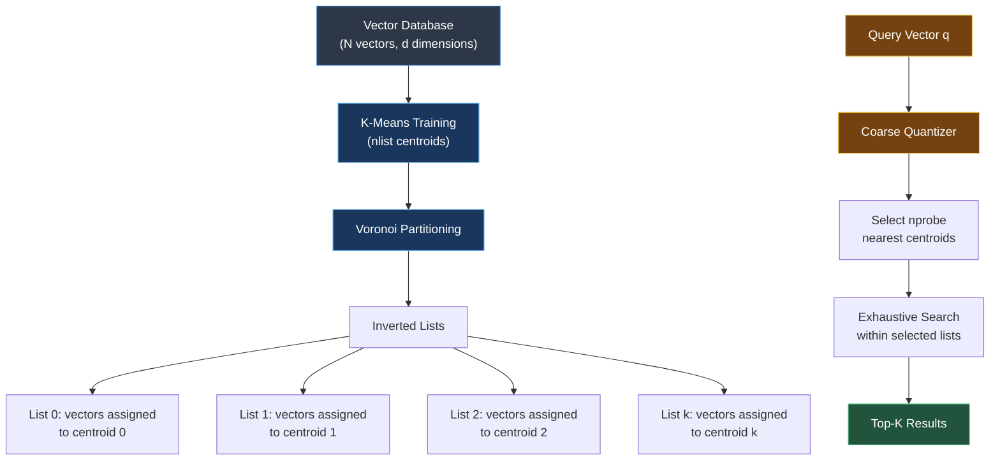

The architecture consists of two distinct phases: **index construction** (offline) and **query processing** (online).

---

## 3. Algorithmic Foundations

### 3.1 Coarse Quantizer: K-Means Clustering

The first stage of IVF-Flat employs Lloyd's algorithm (K-Means) to partition the vector space into `nlist` Voronoi cells.

**Objective Function (K-Means):**

$$\underset{C}{\text{minimize}} \sum_{i=1}^{N} \min_{j \in \{1, \ldots, \text{nlist}\}} \| x_i - c_j \|^2$$

where $C = \{c_1, c_2, \ldots, c_{\text{nlist}}\}$ are the centroids and $x_i$ are the database vectors.

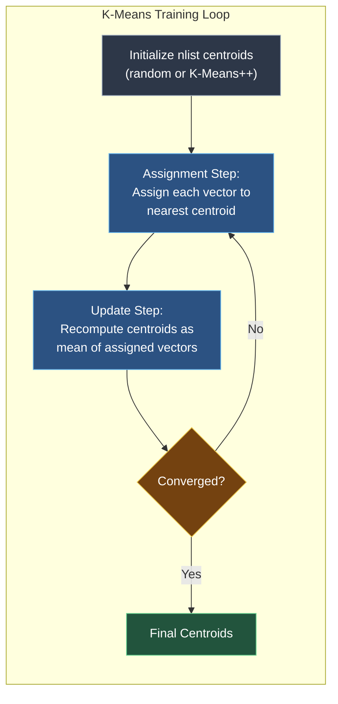

**Key properties of the coarse quantizer:**

- It defines a **quantization function** $q(x) = \arg\min_{j} \|x - c_j\|^2$ that maps each vector to its nearest centroid.
- The resulting Voronoi cells are **convex polytopes** — every point within a cell is closer to that cell's centroid than to any other.
- The quantizer is "flat" because the original vectors are stored **without any compression** inside each inverted list.

### 3.2 Inverted File Structure

After training, each database vector $x_i$ is assigned to the inverted list corresponding to its nearest centroid:

$$\text{list}_j = \{ (id_i, x_i) \mid q(x_i) = j \}$$

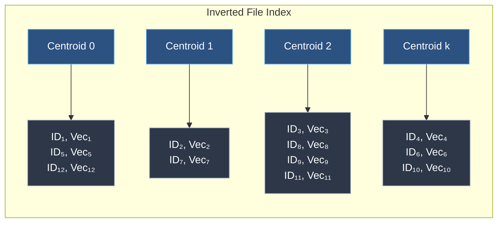

Each inverted list stores:
- The **vector IDs** (for result mapping)
- The **full original vectors** (for exact distance computation — this is the "Flat" part)

### 3.3 Query Processing: Probe and Scan

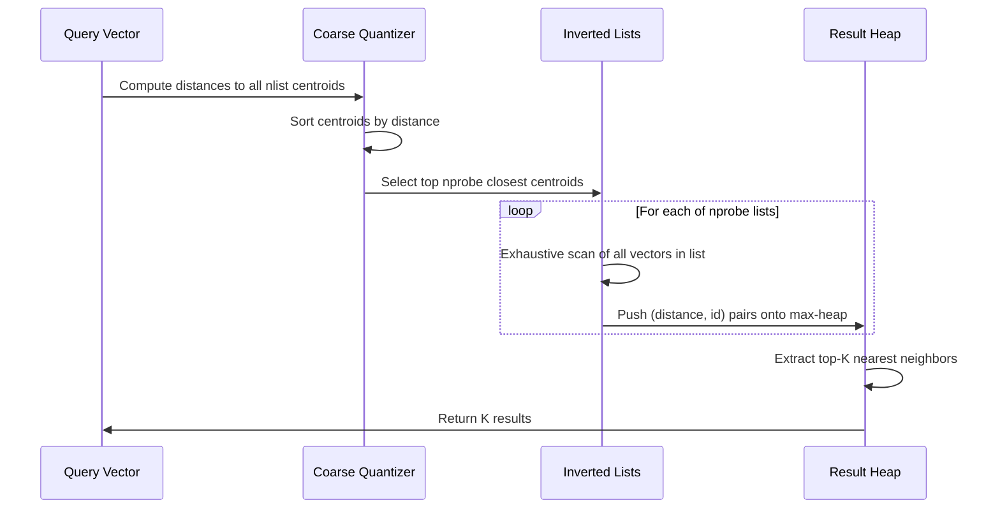

**Search procedure:**

1. **Coarse assignment**: Compute distances from query $q$ to all `nlist` centroids → $O(\text{nlist} \cdot d)$
2. **Probe selection**: Select the `nprobe` nearest centroids
3. **Fine search**: For each selected list, compute exact distances between $q$ and every vector in that list
4. **Result aggregation**: Maintain a max-heap of size $K$ across all probed lists

**Total search complexity:**

$$T_{\text{search}} = O(\text{nlist} \cdot d) + O\left(\text{nprobe} \cdot \frac{N}{\text{nlist}} \cdot d\right)$$

The first term is the coarse quantizer cost; the second is the fine scan cost (assuming uniform distribution of vectors across lists).

---

## 4. Theoretical Analysis

### 4.1 The Speed-Recall Tradeoff

The fundamental tradeoff in IVF-Flat is controlled by two parameters:

| Parameter | Effect on Speed | Effect on Recall |
|-----------|----------------|-----------------|
| `nlist` ↑ | Faster (smaller lists to scan) | Lower (more boundary effects) |
| `nlist` ↓ | Slower (larger lists to scan) | Higher (fewer missed neighbors) |
| `nprobe` ↑ | Slower (more lists scanned) | Higher (more coverage) |
| `nprobe` ↓ | Faster (fewer lists scanned) | Lower (more missed neighbors) |

**Boundary condition**: When `nprobe = nlist`, IVF-Flat degenerates to exact brute-force search with 100% recall (plus the overhead of the coarse quantizer pass).

### 4.2 Voronoi Cell Geometry and Recall Loss

Recall loss in IVF-Flat arises from **cell boundary effects**: a query's true nearest neighbor may reside in a Voronoi cell whose centroid is not among the `nprobe` closest to the query.

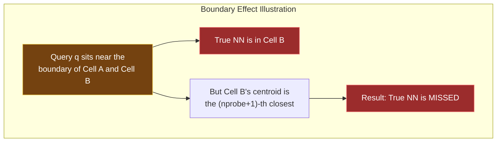

The probability of missing a true nearest neighbor depends on:
- The **angular relationship** between the query-to-NN vector and the cell boundary normal
- The **density of centroids** relative to the data distribution
- The **dimensionality** $d$ — in high dimensions, vectors tend to be equidistant (concentration of measure), making centroid discrimination harder

### 4.3 Quantization Error Analysis

For IVF-Flat specifically, the quantization error is **zero at search time** because original vectors are stored intact. However, the coarse quantizer introduces an **assignment error**:

$$\epsilon_{\text{assign}} = P(\text{NN}(q) \notin \bigcup_{j \in S_{\text{nprobe}}} \text{list}_j)$$

This is the probability that the true nearest neighbor is not found within the probed lists. Increasing `nprobe` monotonically decreases $\epsilon_{\text{assign}}$.

### 4.4 Complexity Comparison

| Operation | Time Complexity | Space Complexity |
|-----------|----------------|-----------------|
| Training (K-Means) | $O(I \cdot N \cdot \text{nlist} \cdot d)$ | $O(\text{nlist} \cdot d)$ |
| Index construction | $O(N \cdot \text{nlist} \cdot d)$ | $O(N \cdot d + \text{nlist} \cdot d)$ |
| Single query | $O(\text{nlist} \cdot d + \text{nprobe} \cdot \frac{N}{\text{nlist}} \cdot d)$ | $O(K)$ for heap |

where $I$ is the number of K-Means iterations.

---

## 5. FAISS Implementation Details

### 5.1 Core API

```python
import faiss
import numpy as np

d = 128          # vector dimension
nlist = 256      # number of Voronoi cells
nprobe = 16      # number of cells to probe at search time

# Build the index
quantizer = faiss.IndexFlatL2(d)           # Coarse quantizer (flat = exact)
index = faiss.IndexIVFFlat(quantizer, d, nlist, faiss.METRIC_L2)

# Train on representative data
training_data = np.random.random((100000, d)).astype('float32')
index.train(training_data)

# Add vectors
database = np.random.random((1000000, d)).astype('float32')
index.add(database)

# Search
index.nprobe = nprobe
queries = np.random.random((100, d)).astype('float32')
distances, indices = index.search(queries, k=10)
```

### 5.2 Internal Architecture in FAISS

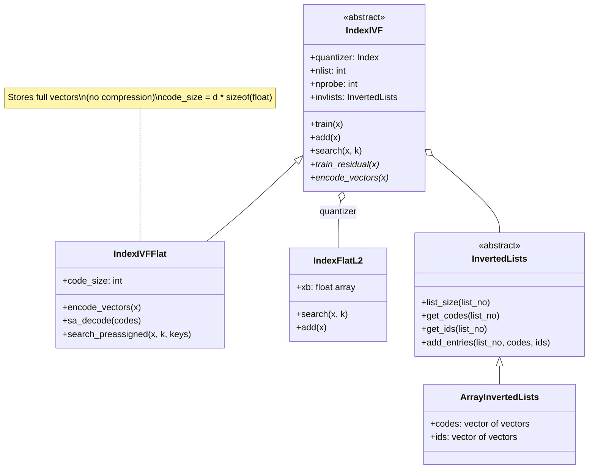

### 5.3 Key Implementation Optimizations in FAISS

FAISS implements several critical optimizations:

**BLAS-accelerated distance computation**: The fine search within inverted lists uses optimized matrix-matrix multiplication (via BLAS libraries like MKL/OpenBLAS) to compute distances in batch, exploiting the identity:

$$\|q - x_i\|^2 = \|q\|^2 - 2 \langle q, x_i \rangle + \|x_i\|^2$$

where the inner product $\langle q, x_i \rangle$ is computed via `sgemm` for all vectors in a list simultaneously.

**Multi-threaded search**: Queries are parallelized across OpenMP threads, with each thread processing a subset of query vectors independently.

**Precomputed norms**: Vector norms $\|x_i\|^2$ can be precomputed and stored alongside the inverted lists, reducing per-query computation.

**Memory layout**: Vectors within each inverted list are stored contiguously in memory, maximizing cache locality during sequential scans.

---

## 6. Relationship to Other ANN Algorithms

### 6.1 Taxonomy of ANN Methods

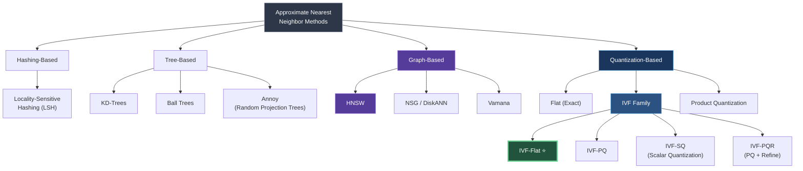

### 6.2 IVF-Flat vs. Other IVF Variants

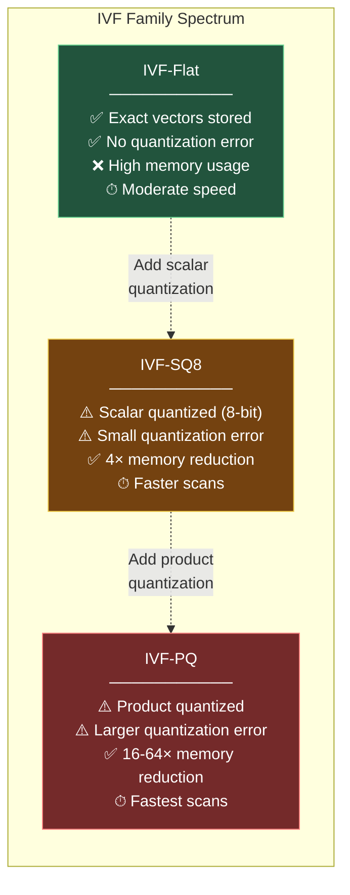

| Variant | Memory per Vector | Quantization Error | Best For |
|---------|------------------|--------------------|----------|
| **IVF-Flat** | $4d$ bytes (float32) | None | High-recall requirements, datasets that fit in RAM |
| **IVF-SQ8** | $d$ bytes (uint8) | Small | Moderate memory savings with minimal recall loss |
| **IVF-PQ** | $M$ bytes ($M$ subquantizers) | Moderate | Large-scale datasets exceeding RAM |
| **IVF-PQR** | $M + M'$ bytes | Small (refined) | High recall with PQ-level memory |

### 6.3 IVF-Flat vs. HNSW

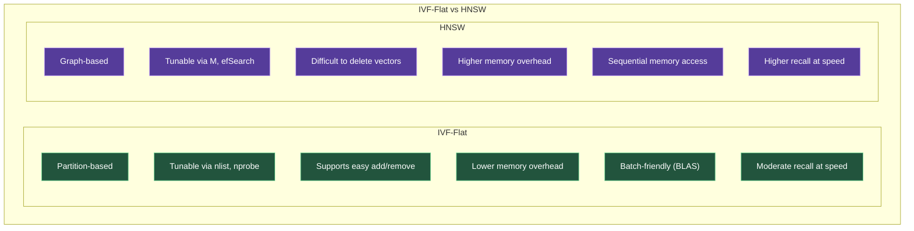

**When to prefer IVF-Flat over HNSW:**
- The dataset is updated frequently (IVF supports efficient add/remove)
- Batch query throughput matters more than single-query latency (BLAS acceleration)
- Memory is constrained (HNSW requires additional graph storage: ~$4 \cdot M \cdot N$ bytes for edge lists)
- GPU acceleration is needed (FAISS IVF-Flat has native GPU support)

**When to prefer HNSW over IVF-Flat:**
- Single-query latency is critical
- The dataset is relatively static
- Very high recall (>99%) is needed at moderate speed
- The dataset has complex, non-uniform clustering structure

### 6.4 IVF-Flat vs. Annoy

Annoy (Approximate Nearest Neighbors Oh Yeah) uses **random projection trees** — an ensemble of binary space partition trees built from random hyperplanes. Compared to IVF-Flat:

- Annoy is **memory-mapped** by design, making it ideal for read-only, disk-based workloads
- IVF-Flat provides **better throughput** for batch queries via BLAS
- Annoy's index is **immutable** after construction; IVF-Flat supports dynamic insertion
- IVF-Flat generally achieves **higher recall** at equivalent query times for high-dimensional data

### 6.5 IVF-Flat vs. LSH

Locality-Sensitive Hashing provides **theoretical guarantees** (sub-linear query time with bounded approximation ratio) that IVF-Flat lacks. However:

- LSH requires many hash tables for high recall, leading to **significant memory overhead**
- IVF-Flat is **far more practical** — empirically achieving better recall-speed tradeoffs
- LSH guarantees hold for worst-case data; IVF-Flat exploits **data structure** (clustering) for efficiency

---

## 7. The Composite Index Pipeline

FAISS supports combining IVF-Flat with preprocessing and post-processing steps:


**FAISS index factory string**: `"PCA64,IVF256,Flat"` — reduces to 64 dimensions via PCA, then builds IVF-Flat with 256 cells.

---

## 8. Parameter Tuning Guidelines

### 8.1 Choosing `nlist`

The number of Voronoi cells should scale with the dataset size:

$$\text{nlist} \approx \sqrt{N} \quad \text{(rule of thumb)}$$

For very large datasets ($N > 10^7$), values in the range $4\sqrt{N}$ to $16\sqrt{N}$ are common.

### 8.2 Choosing `nprobe`

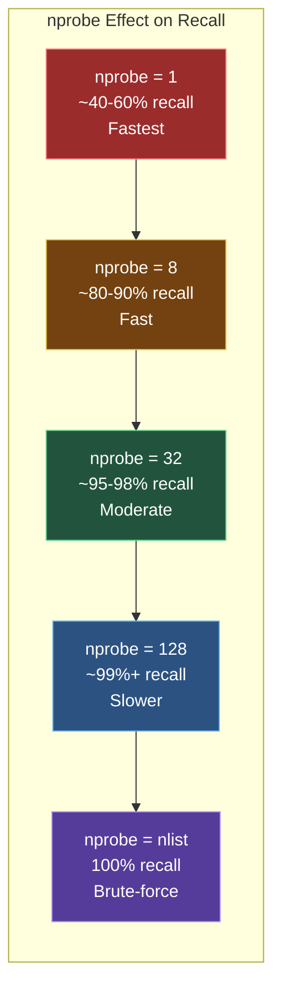

A typical starting point is `nprobe = nlist / 16` or `nprobe = nlist / 8`, then tuning based on empirical recall measurements.

### 8.3 Training Data Requirements

K-Means training requires a representative sample of the data distribution. FAISS recommends:

$$N_{\text{train}} \geq 30 \cdot \text{nlist}$$

Using too few training vectors leads to poor centroid placement and degraded recall.

---

## 9. GPU Acceleration

FAISS provides native GPU support for IVF-Flat via `GpuIndexIVFFlat`:

```python
import faiss

res = faiss.StandardGpuResources()
gpu_index = faiss.GpuIndexIVFFlat(res, d, nlist, faiss.METRIC_L2)
gpu_index.train(training_data)
gpu_index.add(database)

gpu_index.nprobe = nprobe
distances, indices = gpu_index.search(queries, k=10)
```

GPU acceleration provides **10-100× speedup** over CPU for large batch queries by parallelizing both the coarse quantizer and the fine scan stages across thousands of GPU threads.

---

## 10. Summary Decision Flowchart

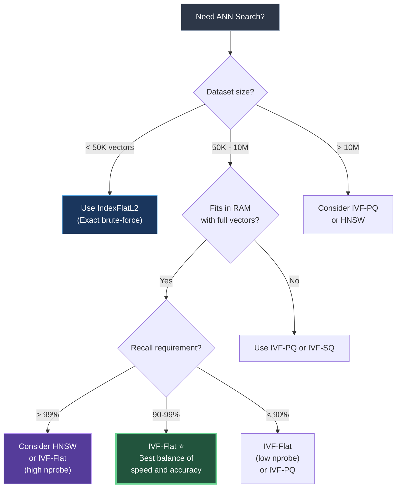

---

## 11. Key Takeaways

IVF-Flat occupies a **sweet spot** in the ANN algorithm landscape. It introduces no quantization error (preserving exact distances), provides tunable speed-recall tradeoffs via `nlist` and `nprobe`, supports dynamic updates and GPU acceleration, and benefits from BLAS-optimized batch processing. Its primary limitation is memory — it stores full vectors, making it impractical for billion-scale datasets without combining it with quantization (IVF-PQ) or dimensionality reduction (PCA). For datasets in the millions where RAM is available and high recall matters, IVF-Flat remains one of the most reliable and well-understood choices in the FAISS toolkit.

---

*Generated for reference on ANN algorithms in FAISS — February 2026*
